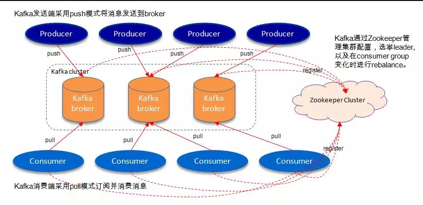
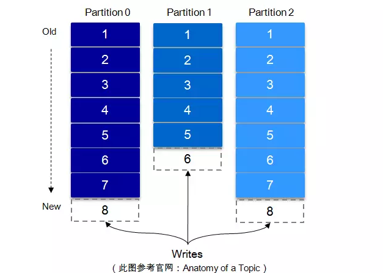

# kafka数据可靠性深度解读（作者:朱忠华）

> Kafka起初是由LinkedIn公司开发的一个分布式的消息系统，后成为Apache的一部分，它使用Scala编写，以可水平扩展和高吞吐率而被广泛使用。目前越来越多的开源分布式处理系统如Cloudera、Apache Storm、Spark等都支持与Kafka集成。

## 概述  

> Kafka与传统消息系统相比，有以下不同：
> 
> * 它被设计为一个分布式系统，易于向外扩展；
> * 它同时为发布和订阅提供高吞吐量；
> * 它支持多订阅者，当失败时能自动平衡消费者；
> * 它将消息持久化到磁盘，因此可用于批量消费，例如ETL以及实时应用程序。

Kafka凭借着自身的优势，越来越受到互联网企业的青睐，唯品会也采用Kafka作为其内部核心消息引擎之一。Kafka作为一个商业级消息中间件，消息可靠性的重要性可想而知。如何确保消息的精确传输？如何确保消息的准确存储？如何确保消息的正确消费？这些都是需要考虑的问题。本文首先从Kafka的架构着手，先了解下Kafka的基本原理，然后通过对kakfa的存储机制、复制原理、同步原理、可靠性和持久性保证等等一步步对其可靠性进行分析，最后通过benchmark来增强对Kafka高可靠性的认知。

## Kafka体系架构 

如上图所示，一个典型的Kafka体系架构包括若干Producer（可以是服务器日志，业务数据，页面前端产生的page view等等），若干broker（Kafka支持水平扩展，一般broker数量越多，集群吞吐率越高），若干Consumer (Group)，以及一个Zookeeper集群。Kafka通过Zookeeper管理集群配置，选举leader，以及在consumer group发生变化时进行rebalance。Producer使用push(推)模式将消息发布到broker，Consumer使用pull(拉)模式从broker订阅并消费消息。

**名词解释:**
<table>
<tr><th>名称</th><th>解释</th></tr>
<tr><td>Broker</td><td>消息中间件处理节点，一个Kafka节点就是一个broker，一个或者多个Broker可以组成一个Kafka集群</td></tr>
<tr><td>Topic</td><td>Kafka根据topic对消息进行归类，发布到Kafka集群的每条消息都需要指定一个topic</td></tr>
<tr><td>Producer</td><td>消息生产者，向Broker发送消息的客户端</td></tr>
<tr><td>Consumer</td><td>消息消费者，从Broker读取消息的客户端</td></tr>
<tr><td>ConsumerGroup</td><td>每个Consumer属于一个特定的Consumer Group，一条消息可以发送到多个不同的Consumer Group，但是一个Consumer Group中只能有一个Consumer能够消费该消息</td></tr>
<tr><td>Partition</td><td>物理上的概念，一个topic可以分为多个partition，每个partition内部是有序的</td></tr>
</table>

2.1 Topic & Partition

一个topic可以认为一个一类消息，每个topic将被分成多个partition，每个partition在存储层面是append log文件。任何发布到此partition的消息都会被追加到log文件的尾部，每条消息在文件中的位置称为offset(偏移量)，offset为一个long型的数字，它唯一标记一条消息。每条消息都被append到partition中，是顺序写磁盘，因此效率非常高（经验证，顺序写磁盘效率比随机写内存还要高，这是Kafka高吞吐率的一个很重要的保证）。

