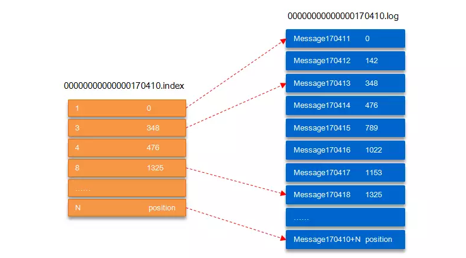
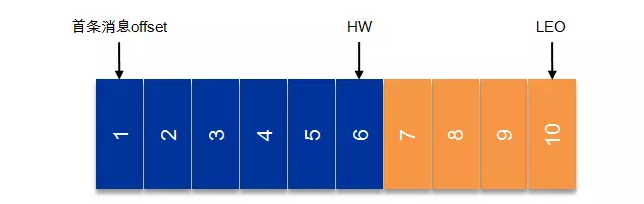
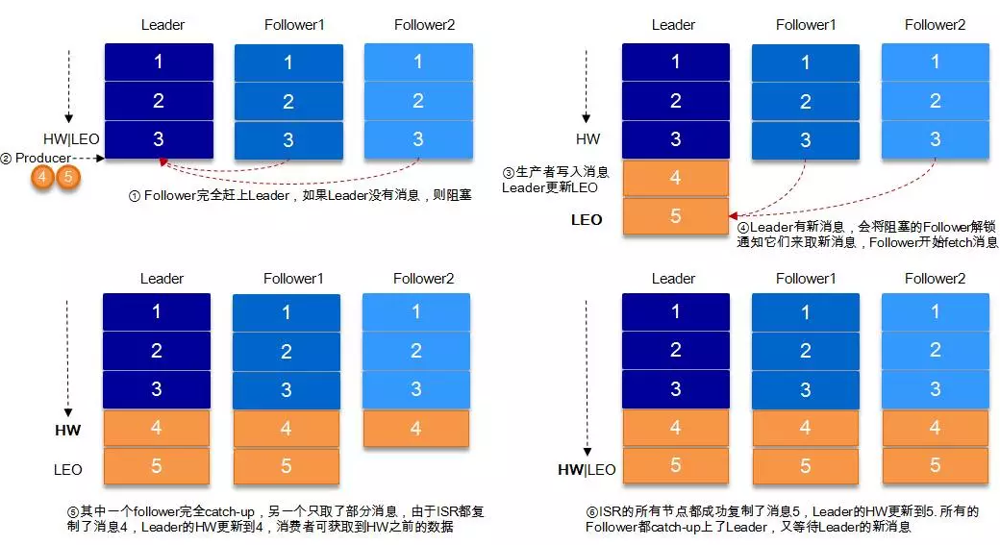
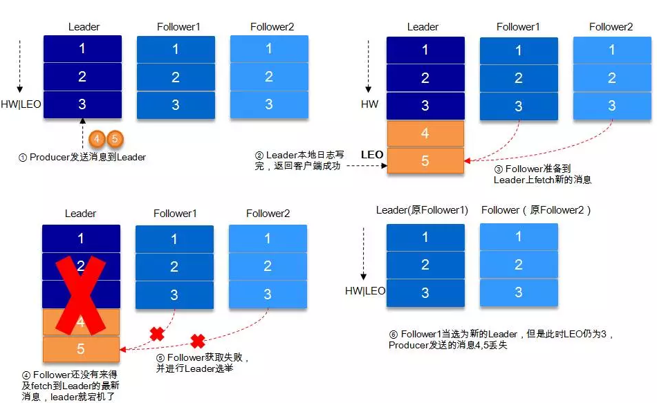
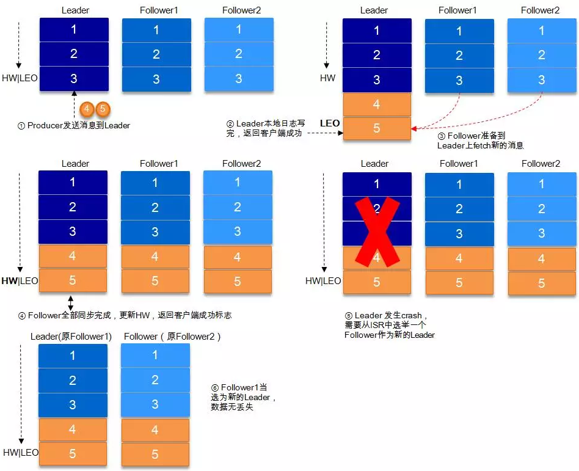
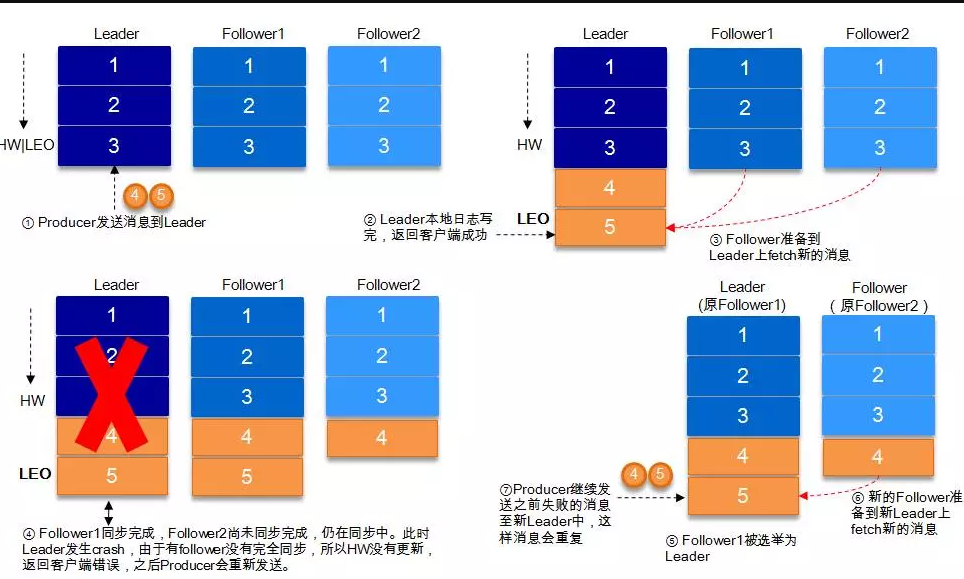
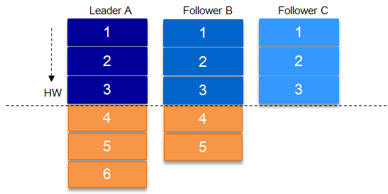
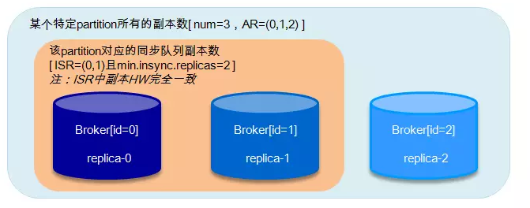
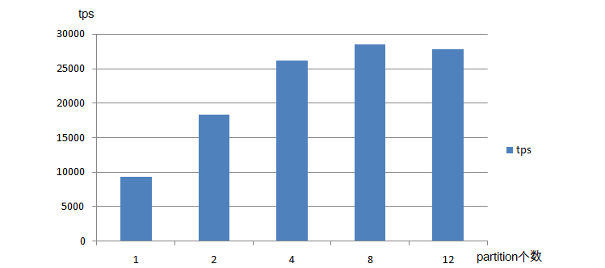

# kafka数据可靠性深度解读（作者:朱忠华）

> Kafka起初是由LinkedIn公司开发的一个分布式的消息系统，后成为Apache的一部分，它使用Scala编写，以可水平扩展和高吞吐率而被广泛使用。目前越来越多的开源分布式处理系统如Cloudera、Apache Storm、Spark等都支持与Kafka集成。


## 概述  

> Kafka与传统消息系统相比，有以下不同：
> 
> * 它被设计为一个分布式系统，易于向外扩展；
> * 它同时为发布和订阅提供高吞吐量；
> * 它支持多订阅者，当失败时能自动平衡消费者；
> * 它将消息持久化到磁盘，因此可用于批量消费，例如ETL以及实时应用程序。

Kafka凭借着自身的优势，越来越受到互联网企业的青睐，唯品会也采用Kafka作为其内部核心消息引擎之一。Kafka作为一个商业级消息中间件，消息可靠性的重要性可想而知。如何确保消息的精确传输？如何确保消息的准确存储？如何确保消息的正确消费？这些都是需要考虑的问题。本文首先从Kafka的架构着手，先了解下Kafka的基本原理，然后通过对kakfa的存储机制、复制原理、同步原理、可靠性和持久性保证等等一步步对其可靠性进行分析，最后通过benchmark来增强对Kafka高可靠性的认知。

## Kafka体系架构 


如上图所示，一个典型的Kafka体系架构包括若干Producer（可以是服务器日志，业务数据，页面前端产生的page view等等），若干broker（Kafka支持水平扩展，一般broker数量越多，集群吞吐率越高），若干Consumer (Group)，以及一个Zookeeper集群。Kafka通过Zookeeper管理集群配置，选举leader，以及在consumer group发生变化时进行rebalance。Producer使用push(推)模式将消息发布到broker，Consumer使用pull(拉)模式从broker订阅并消费消息。

**名词解释:**
<table>
<tr><th>名称</th><th>解释</th></tr>
<tr><td>Broker</td><td>消息中间件处理节点，一个Kafka节点就是一个broker，一个或者多个Broker可以组成一个Kafka集群</td></tr>
<tr><td>Topic</td><td>Kafka根据topic对消息进行归类，发布到Kafka集群的每条消息都需要指定一个topic</td></tr>
<tr><td>Producer</td><td>消息生产者，向Broker发送消息的客户端</td></tr>
<tr><td>Consumer</td><td>消息消费者，从Broker读取消息的客户端</td></tr>
<tr><td>ConsumerGroup</td><td>每个Consumer属于一个特定的Consumer Group，一条消息可以发送到多个不同的Consumer Group，但是一个Consumer Group中只能有一个Consumer能够消费该消息</td></tr>
<tr><td>Partition</td><td>物理上的概念，一个topic可以分为多个partition，每个partition内部是有序的</td></tr>
</table>

<p><center>2.1 Topic & Partition</center></p>


一个topic可以认为一个一类消息，每个topic将被分成多个partition，每个partition在存储层面是append log文件。任何发布到此partition的消息都会被追加到log文件的尾部，每条消息在文件中的位置称为offset(偏移量)，offset为一个long型的数字，它唯一标记一条消息。每条消息都被append到partition中，是顺序写磁盘，因此效率非常高（经验证，顺序写磁盘效率比随机写内存还要高，这是Kafka高吞吐率的一个很重要的保证）。


每一条消息被发送到broker中，会根据partition规则选择被存储到哪一个partition。如果partition规则设置的合理，所有消息可以均匀分布到不同的partition里，这样就实现了水平扩展。（如果一个topic对应一个文件，那这个文件所在的机器I/O将会成为这个topic的性能瓶颈，而partition解决了这个问题）。在创建topic时可以在$KAFKA_HOME/config/server.properties中指定这个partition的数量（如下所示），当然可以在topic创建之后去修改partition的数量。

```bash
# The default number of log partitions per topic. More partitions allow greater
# parallelism for consumption, but this will also result in more files across
# the brokers.
num.partitions=3
```

在发送一条消息时，可以指定这个消息的key，producer根据这个key和partition机制来判断这个消息发送到哪个partition。partition机制可以通过指定producer的partition.class这一参数来指定，该class必须实现kafka.producer.Partitioner接口。

有关Topic与Partition的更多细节，可以参考下面的“Kafka文件存储机制”这一节。

## 高可靠性存储分析 
Kafka的高可靠性的保障来源于其健壮的副本（replication）策略。通过调节其副本相关参数，可以使得Kafka在性能和可靠性之间运转的游刃有余。Kafka从0.8.x版本开始提供partition级别的复制,replication的数量可以在$KAFKA_HOME/config/server.properties中配置（default.replication.refactor）。

这里先从Kafka文件存储机制入手，从最底层了解Kafka的存储细节，进而对其的存储有个微观的认知。之后通过Kafka复制原理和同步方式来阐述宏观层面的概念。最后从ISR，HW，leader选举以及数据可靠性和持久性保证等等各个维度来丰富对Kafka相关知识点的认知。

###  Kafka文件存储机制  
Kafka中消息是以topic进行分类的，生产者通过topic向Kafka broker发送消息，消费者通过topic读取数据。然而topic在物理层面又能以partition为分组，一个topic可以分成若干个partition，那么topic以及partition又是怎么存储的呢？partition还可以细分为segment，一个partition物理上由多个segment组成，那么这些segment又是什么呢？下面我们来一一揭晓。

为了便于说明问题，假设这里只有一个Kafka集群，且这个集群只有一个Kafka broker，即只有一台物理机。在这个Kafka broker中配置（$KAFKA_HOME/config/server.properties中）log.dirs=/tmp/kafka-logs，以此来设置Kafka消息文件存储目录，与此同时创建一个topic：topic_vms_test，partition的数量为4（$KAFKA_HOME/bin/kafka-topics.sh --create --zookeeper localhost:2181 --partitions 4 --topic topic_vms_test --replication-factor 4）。那么我们此时可以在/tmp/kafka-logs目录中可以看到生成了4个目录：

```bash
drwxr-xr-x 2 root root 4096 Apr 10 16:10 topic_vms_test-0
drwxr-xr-x 2 root root 4096 Apr 10 16:10 topic_vms_test-1
drwxr-xr-x 2 root root 4096 Apr 10 16:10 topic_vms_test-2
drwxr-xr-x 2 root root 4096 Apr 10 16:10 topic_vms_test-3
```

在Kafka文件存储中，同一个topic下有多个不同的partition，每个partiton为一个目录，partition的名称规则为：topic名称+有序序号，第一个序号从0开始计，最大的序号为partition数量减1，partition是实际物理上的概念，而topic是逻辑上的概念。

上面提到partition还可以细分为segment，这个segment又是什么？如果就以partition为最小存储单位，我们可以想象当Kafka producer不断发送消息，必然会引起partition文件的无限扩张，这样对于消息文件的维护以及已经被消费的消息的清理带来严重的影响，所以这里以segment为单位又将partition细分。每个partition(目录)相当于一个巨型文件被平均分配到多个大小相等的segment(段)数据文件中（每个segment 文件中消息数量不一定相等）这种特性也方便old segment的删除，即方便已被消费的消息的清理，提高磁盘的利用率。每个partition只需要支持顺序读写就行，segment的文件生命周期由服务端配置参数（log.segment.bytes，log.roll.{ms,hours}等若干参数）决定。

segment文件由两部分组成，分别为“.index”文件和“.log”文件，分别表示为segment索引文件和数据文件。这两个文件的命令规则为：partition全局的第一个segment从0开始，后续每个segment文件名为上一个segment文件最后一条消息的offset值，数值大小为64位，20位数字字符长度，没有数字用0填充，如下：

```bash
00000000000000000000.index
00000000000000000000.log
00000000000000170410.index
00000000000000170410.log
00000000000000239430.index
00000000000000239430.log
```

以上面的segment文件为例，展示出segment：00000000000000170410的“.index”文件和“.log”文件的对应的关系，如下图：


如上图，“.index”索引文件存储大量的元数据，“.log”数据文件存储大量的消息，索引文件中的元数据指向对应数据文件中message的物理偏移地址。其中以“.index”索引文件中的元数据[3, 348]为例，在“.log”数据文件表示第3个消息，即在全局partition中表示170410+3=170413个消息，该消息的物理偏移地址为348。

那么如何从partition中通过offset查找message呢？以上图为例，读取offset=170418的消息，首先查找segment文件，其中00000000000000000000.index为最开始的文件，第二个文件为00000000000000170410.index（起始偏移为170410+1=170411），而第三个文件为00000000000000239430.index（起始偏移为239430+1=239431），所以这个offset=170418就落到了第二个文件之中。其他后续文件可以依次类推，以其实偏移量命名并排列这些文件，然后根据二分查找法就可以快速定位到具体文件位置。其次根据00000000000000170410.index文件中的[8,1325]定位到00000000000000170410.log文件中的1325的位置进行读取。

*要是读取offset=170418的消息，从00000000000000170410.log文件中的1325的位置进行读取，那么怎么知道何时读完本条消息，否则就读到下一条消息的内容了？这个就需要联系到消息的物理结构了，消息都具有固定的物理结构，包括：offset（8 Bytes）、消息体的大小（4 Bytes）、crc32（4 Bytes）、magic（1 Byte）、attributes（1 Byte）、key length（4 Bytes）、key（K Bytes）、payload(N Bytes)等等字段，可以确定一条消息的大小，即读取到哪里截止。*

###  复制原理和同步方式  

Kafka中topic的每个partition有一个预写式的日志文件，虽然partition可以继续细分为若干个segment文件，但是对于上层应用来说可以将partition看成最小的存储单元（一个有多个segment文件拼接的“巨型”文件），每个partition都由一些列有序的、不可变的消息组成，这些消息被连续的追加到partition中。


上图中有两个新名词：HW和LEO。这里先介绍下LEO，LogEndOffset的缩写，表示每个partition的log最后一条Message的位置。HW是HighWatermark的缩写，是指consumer能够看到的此partition的位置，这个涉及到多副本的概念，这里先提及一下，下节再详表。

言归正传，为了提高消息的可靠性，Kafka每个topic的partition有N个副本（replicas），其中N(大于等于1)是topic的复制因子（replica fator）的个数。Kafka通过多副本机制实现故障自动转移，当Kafka集群中一个broker失效情况下仍然保证服务可用。在Kafka中发生复制时确保partition的日志能有序地写到其他节点上，N个replicas中，其中一个replica为leader，其他都为follower, leader处理partition的所有读写请求，与此同时，follower会被动定期地去复制leader上的数据。

如下图所示，Kafka集群中有4个broker, 某topic有3个partition,且复制因子即副本个数也为3：


Kafka提供了数据复制算法保证，如果leader发生故障或挂掉，一个新leader被选举并被接受客户端的消息成功写入。Kafka确保从同步副本列表中选举一个副本为leader，或者说follower追赶leader数据。leader负责维护和跟踪ISR(In-Sync Replicas的缩写，表示副本同步队列，具体可参考下节)中所有follower滞后的状态。当producer发送一条消息到broker后，leader写入消息并复制到所有follower。消息提交之后才被成功复制到所有的同步副本。消息复制延迟受最慢的follower限制，重要的是快速检测慢副本，如果follower“落后”太多或者失效，leader将会把它从ISR中删除。

### ISR

上节我们涉及到ISR (In-Sync Replicas)，这个是指副本同步队列。副本数对Kafka的吞吐率是有一定的影响，但极大的增强了可用性。默认情况下Kafka的replica数量为1，即每个partition都有一个唯一的leader，为了确保消息的可靠性，通常应用中将其值(由broker的参数offsets.topic.replication.factor指定)大小设置为大于1，比如3。 所有的副本（replicas）统称为Assigned Replicas，即AR。

ISR是AR中的一个子集，由leader维护ISR列表，follower从leader同步数据有一些延迟（包括延迟时间replica.lag.time.max.ms和延迟条数replica.lag.max.messages两个维度, 当前最新的版本0.10.x中只支持replica.lag.time.max.ms这个维度），任意一个超过阈值都会把follower剔除出ISR, 存入OSR（Outof-Sync Replicas）列表，新加入的follower也会先存放在OSR中。AR=ISR+OSR。

Kafka 0.10.x版本后移除了replica.lag.max.messages参数，只保留了replica.lag.time.max.ms作为ISR中副本管理的参数。为什么这样做呢？replica.lag.max.messages表示当前某个副本落后leaeder的消息数量超过了这个参数的值，那么leader就会把follower从ISR中删除。假设设置replica.lag.max.messages=4，那么如果producer一次传送至broker的消息数量都小于4条时，因为在leader接受到producer发送的消息之后而follower副本开始拉取这些消息之前，follower落后leader的消息数不会超过4条消息，故此没有follower移出ISR，所以这时候replica.lag.max.message的设置似乎是合理的。

但是producer发起瞬时高峰流量，producer一次发送的消息超过4条时，也就是超过replica.lag.max.messages，此时follower都会被认为是与leader副本不同步了，从而被踢出了ISR。但实际上这些follower都是存活状态的且没有性能问题。那么在之后追上leader,并被重新加入了ISR。于是就会出现它们不断地剔出ISR然后重新回归ISR，这无疑增加了无谓的性能损耗。而且这个参数是broker全局的。设置太大了，影响真正“落后”follower的移除；设置的太小了，导致follower的频繁进出。无法给定一个合适的replica.lag.max.messages的值，故此，新版本的Kafka移除了这个参数。

*注：ISR中包括：leader和follower。*

上面一节还涉及到一个概念，即HW。HW俗称高水位，HighWatermark的缩写，取一个partition对应的ISR中最小的LEO作为HW，consumer最多只能消费到HW所在的位置。另外每个replica都有HW,leader和follower各自负责更新自己的HW的状态。对于leader新写入的消息，consumer不能立刻消费，leader会等待该消息被所有ISR中的replicas同步后更新HW，此时消息才能被consumer消费。这样就保证了如果leader所在的broker失效，该消息仍然可以从新选举的leader中获取。对于来自内部broKer的读取请求，没有HW的限制。

下图详细的说明了当producer生产消息至broker后，ISR以及HW和LEO的流转过程：



由此可见，Kafka的复制机制既不是完全的同步复制，也不是单纯的异步复制。事实上，同步复制要求所有能工作的follower都复制完，这条消息才会被commit，这种复制方式极大的影响了吞吐率。而异步复制方式下，follower异步的从leader复制数据，数据只要被leader写入log就被认为已经commit，这种情况下如果follower都还没有复制完，落后于leader时，突然leader宕机，则会丢失数据。而Kafka的这种使用ISR的方式则很好的均衡了确保数据不丢失以及吞吐率。


Kafka的ISR的管理最终都会反馈到Zookeeper节点上。具体位置为：/brokers/topics/[topic]/partitions/[partition]/state。目前有两个地方会对这个Zookeeper的节点进行维护：

> 1. Controller来维护：Kafka集群中的其中一个Broker会被选举为Controller，主要负责Partition管理和副本状态管理，也会执行类似于重分配partition之类的管理任务。在符合某些特定条件下，Controller下的LeaderSelector会选举新的leader，ISR和新的leader_epoch及controller_epoch写入Zookeeper的相关节点中。同时发起LeaderAndIsrRequest通知所有的replicas。
> 2. leader来维护：leader有单独的线程定期检测ISR中follower是否脱离ISR, 如果发现ISR变化，则会将新的ISR的信息返回到Zookeeper的相关节点中。


### 数据可靠性和持久性保证

当producer向leader发送数据时，可以通过request.required.acks参数来设置数据可靠性的级别：

> * 1（默认）：这意味着producer在ISR中的leader已成功收到的数据并得到确认后发送下一条message。如果leader宕机了，则会丢失数据。
> * 0：这意味着producer无需等待来自broker的确认而继续发送下一批消息。这种情况下数据传输效率最高，但是数据可靠性确是最低的。
> * -1：producer需要等待ISR中的所有follower都确认接收到数据后才算一次发送完成，可靠性最高。但是这样也不能保证数据不丢失，比如当ISR中只有leader时（前面ISR那一节讲到，ISR中的成员由于某些情况会增加也会减少，最少就只剩一个leader），这样就变成了acks=1的情况。

如果要提高数据的可靠性，在设置request.required.acks=-1的同时，也要min.insync.replicas这个参数(可以在broker或者topic层面进行设置)的配合，这样才能发挥最大的功效。min.insync.replicas这个参数设定ISR中的最小副本数是多少，默认值为1，当且仅当request.required.acks参数设置为-1时，此参数才生效。如果ISR中的副本数少于min.insync.replicas配置的数量时，客户端会返回异常：org.apache.kafka.common.errors.NotEnoughReplicasExceptoin: Messages are rejected since there are fewer in-sync replicas than required。

接下来对acks=1和-1的两种情况进行详细分析：

**1. request.required.acks=1**
producer发送数据到leader，leader写本地日志成功，返回客户端成功；此时ISR中的副本还没有来得及拉取该消息，leader就宕机了，那么此次发送的消息就会丢失。


**2. equest.required.acks=-1**

同步（Kafka默认为同步，即producer.type=sync）的发送模式，replication.factor>=2且min.insync.replicas>=2的情况下，不会丢失数据。

有两种典型情况。acks=-1的情况下（如无特殊说明，以下acks都表示为参数request.required.acks），数据发送到leader, ISR的follower全部完成数据同步后，leader此时挂掉，那么会选举出新的leader，数据不会丢失。


acks=-1的情况下，数据发送到leader后 ，部分ISR的副本同步，leader此时挂掉。比如follower1h和follower2都有可能变成新的leader, producer端会得到返回异常，producer端会重新发送数据，数据可能会重复。



当然上图中如果在leader crash的时候，follower2还没有同步到任何数据，而且follower2被选举为新的leader的话，这样消息就不会重复。

*注：Kafka只处理fail/recover问题,不处理Byzantine问题。*

### 关于HW的进一步探讨  

考虑上图（即acks=-1,部分ISR副本同步）中的另一种情况，如果在Leader挂掉的时候，follower1同步了消息4,5，follower2同步了消息4，与此同时follower2被选举为leader，那么此时follower1中的多出的消息5该做如何处理呢？

这里就需要HW的协同配合了。如前所述，一个partition中的ISR列表中，leader的HW是所有ISR列表里副本中最小的那个的LEO。类似于木桶原理，水位取决于最低那块短板。



如上图，某个topic的某partition有三个副本，分别为A、B、C。A作为leader肯定是LEO最高，B紧随其后，C机器由于配置比较低，网络比较差，故而同步最慢。这个时候A机器宕机，这时候如果B成为leader，假如没有HW，在A重新恢复之后会做同步(makeFollower)操作，在宕机时log文件之后直接做追加操作，而假如B的LEO已经达到了A的LEO，会产生数据不一致的情况，所以使用HW来避免这种情况。A在做同步操作的时候，先将log文件截断到之前自己的HW的位置，即3，之后再从B中拉取消息进行同步。

如果失败的follower恢复过来，它首先将自己的log文件截断到上次checkpointed时刻的HW的位置，之后再从leader中同步消息。leader挂掉会重新选举，新的leader会发送“指令”让其余的follower截断至自身的HW的位置然后再拉取新的消息。

*当ISR中的个副本的LEO不一致时，如果此时leader挂掉，选举新的leader时并不是按照LEO的高低进行选举，而是按照ISR中的顺序选举。*

### Leader选举  

一条消息只有被ISR中的所有follower都从leader复制过去才会被认为已提交。这样就避免了部分数据被写进了leader，还没来得及被任何follower复制就宕机了，而造成数据丢失。而对于producer而言，它可以选择是否等待消息commit，这可以通过request.required.acks来设置。这种机制确保了只要ISR中有一个或者以上的follower，一条被commit的消息就不会丢失。

有一个很重要的问题是当leader宕机了，怎样在follower中选举出新的leader，因为follower可能落后很多或者直接crash了，所以必须确保选择“最新”的follower作为新的leader。一个基本的原则就是，如果leader不在了，新的leader必须拥有原来的leader commit的所有消息。这就需要做一个折中，如果leader在表名一个消息被commit前等待更多的follower确认，那么在它挂掉之后就有更多的follower可以成为新的leader，但这也会造成吞吐率的下降。

一种非常常用的选举leader的方式是“少数服从多数”，Kafka并不是采用这种方式。这种模式下，如果我们有2f+1个副本，那么在commit之前必须保证有f+1个replica复制完消息，同时为了保证能正确选举出新的leader，失败的副本数不能超过f个。这种方式有个很大的优势，系统的延迟取决于最快的几台机器，也就是说比如副本数为3，那么延迟就取决于最快的那个follower而不是最慢的那个。

“少数服从多数”的方式也有一些劣势，为了保证leader选举的正常进行，它所能容忍的失败的follower数比较少，如果要容忍1个follower挂掉，那么至少要3个以上的副本，如果要容忍2个follower挂掉，必须要有5个以上的副本。也就是说，在生产环境下为了保证较高的容错率，必须要有大量的副本，而大量的副本又会在大数据量下导致性能的急剧下降。这种算法更多用在Zookeeper这种共享集群配置的系统中而很少在需要大量数据的系统中使用的原因。HDFS的HA功能也是基于“少数服从多数”的方式，但是其数据存储并不是采用这样的方式。

实际上，leader选举的算法非常多，比如Zookeeper的Zab、Raft以及Viewstamped Replication。而Kafka所使用的leader选举算法更像是微软的PacificA算法。
Kafka在Zookeeper中为每一个partition动态的维护了一个ISR，这个ISR里的所有replica都跟上了leader，只有ISR里的成员才能有被选为leader的可能（unclean.leader.election.enable=false）。在这种模式下，对于f+1个副本，一个Kafka topic能在保证不丢失已经commit消息的前提下容忍f个副本的失败，在大多数使用场景下，这种模式是十分有利的。事实上，为了容忍f个副本的失败，“少数服从多数”的方式和ISR在commit前需要等待的副本的数量是一样的，但是ISR需要的总的副本的个数几乎是“少数服从多数”的方式的一半。

上文提到，在ISR中至少有一个follower时，Kafka可以确保已经commit的数据不丢失，但如果某一个partition的所有replica都挂了，就无法保证数据不丢失了。这种情况下有两种可行的方案：

> 1. 等待ISR中任意一个replica“活”过来，并且选它作为leader
> 2. 选择第一个“活”过来的replica（并不一定是在ISR中）作为leader

这就需要在可用性和一致性当中作出一个简单的抉择。如果一定要等待ISR中的replica“活”过来，那不可用的时间就可能会相对较长。而且如果ISR中所有的replica都无法“活”过来了，或者数据丢失了，这个partition将永远不可用。选择第一个“活”过来的replica作为leader,而这个replica不是ISR中的replica,那即使它并不保障已经包含了所有已commit的消息，它也会成为leader而作为consumer的数据源。默认情况下，Kafka采用第二种策略，即unclean.leader.election.enable=true，也可以将此参数设置为false来启用第一种策略。

unclean.leader.election.enable这个参数对于leader的选举、系统的可用性以及数据的可靠性都有至关重要的影响。下面我们来分析下几种典型的场景。



如果上图所示，假设某个partition中的副本数为3，replica-0, replica-1, replica-2分别存放在broker0, broker1和broker2中。AR=(0,1,2)，ISR=(0,1)。设置request.required.acks=-1, min.insync.replicas=2，unclean.leader.election.enable=false。这里讲broker0中的副本也称之为broker0起初broker0为leader，broker1为follower。

* 当ISR中的replica-0出现crash的情况时，broker1选举为新的leader[ISR=(1)]，因为受min.insync.replicas=2影响，write不能服务，但是read能继续正常服务。此种情况恢复方案：

> 1. 尝试恢复(重启)replica-0，如果能起来，系统正常；
> 2. 如果replica-0不能恢复，需要将min.insync.replicas设置为1，恢复write功能。

* 当ISR中的replica-0出现crash，紧接着replica-1也出现了crash, 此时[ISR=(1),leader=-1],不能对外提供服务，此种情况恢复方案：

> 1. 尝试恢复replica-0和replica-1，如果都能起来，则系统恢复正常；
> 2. 如果replica-0起来，而replica-1不能起来，这时候仍然不能选出leader，因为当设置unclean.leader.election.enable=false时，leader只能从ISR中选举，当ISR中所有副本都失效之后，需要ISR中最后失效的那个副本能恢复之后才能选举leader, 即replica-0先失效，replica-1后失效，需要replica-1恢复后才能选举leader。保守的方案建议把unclean.leader.election.enable设置为true,但是这样会有丢失数据的情况发生，这样可以恢复read服务。同样需要将min.insync.replicas设置为1，恢复write功能；
> 3. replica-1恢复，replica-0不能恢复，这个情况上面遇到过，read服务可用，需要将min.insync.replicas设置为1，恢复write功能；
> 4. replica-0和replica-1都不能恢复，这种情况可以参考情形2.
 
* 当ISR中的replica-0, replica-1同时宕机,此时[ISR=(0,1)],不能对外提供服务，此种情况恢复方案：尝试恢复replica-0和replica-1，当其中任意一个副本恢复正常时，对外可以提供read服务。直到2个副本恢复正常，write功能才能恢复，或者将将min.insync.replicas设置为1。

### Kafka的发送模式  

Kafka的发送模式由producer端的配置参数producer.type来设置，这个参数指定了在后台线程中消息的发送方式是同步的还是异步的，默认是同步的方式，即producer.type=sync。如果设置成异步的模式，即producer.type=async，可以是producer以batch的形式push数据，这样会极大的提高broker的性能，但是这样会增加丢失数据的风险。如果需要确保消息的可靠性，必须要将producer.type设置为sync。

对于异步模式，还有4个配套的参数，如下：

<table>
<tr><th>Property</th><th>Description</th></tr>
<tr><td>queue.buffering.max.ms</td><td>默认值：5000。启用异步模式时，producer缓存消息的时间。比如我们设置成1000时，它会缓存1s的数据再一次发送出去，这样可以极大的增加broker吞吐量，但也会造成时效性的降低。</td></tr>
<tr><td>queue.buffering.max.messages</td><td>默认值：10000。启用异步模式时，producer缓存队列里最大缓存的消息数量，如果超过这个值，producer就会阻塞或者丢掉消息。</td></tr>
<tr><td>queue.enqueue.timeout.ms</td><td>默认值：-1。当达到上面参数时producer会阻塞等待的时间。如果设置为0，buffer队列满时producer不会阻塞，消息直接被丢掉；若设置为-1，producer会被阻塞，不会丢消息。</td></tr>
<tr><td>batch.num.messages</td><td>默认值：200。启用异步模式时，一个batch缓存的消息数量。达到这个数值时，producer才会发送消息。（每次批量发送的数量）</td></tr>
</table>

*以batch的方式推送数据可以极大的提高处理效率，kafka producer可以将消息在内存中累计到一定数量后作为一个batch发送请求。batch的数量大小可以通过producer的参数（batch.num.messages）控制。通过增加batch的大小，可以减少网络请求和磁盘IO的次数，当然具体参数设置需要在效率和时效性方面做一个权衡。在比较新的版本中还有batch.size这个参数。*

## 高可靠性使用分析  

### 消息传输保障  
前面已经介绍了Kafka如何进行有效的存储，以及了解了producer和consumer如何工作。接下来讨论的是Kafka如何确保消息在producer和consumer之间传输。有以下三种可能的传输保障（delivery guarantee）:

> * At most once: 消息可能会丢，但绝不会重复传输
> * At least once：消息绝不会丢，但可能会重复传输
> * Exactly once：每条消息肯定会被传输一次且仅传输一次

Kafka的消息传输保障机制非常直观。当producer向broker发送消息时，一旦这条消息被commit，由于副本机制（replication）的存在，它就不会丢失。但是如果producer发送数据给broker后，遇到的网络问题而造成通信中断，那producer就无法判断该条消息是否已经提交（commit）。虽然Kafka无法确定网络故障期间发生了什么，但是producer可以retry多次，确保消息已经正确传输到broker中，所以目前Kafka实现的是at least once。

consumer从broker中读取消息后，可以选择commit，该操作会在Zookeeper中存下该consumer在该partition下读取的消息的offset。该consumer下一次再读该partition时会从下一条开始读取。如未commit，下一次读取的开始位置会跟上一次commit之后的开始位置相同。当然也可以将consumer设置为autocommit，即consumer一旦读取到数据立即自动commit。如果只讨论这一读取消息的过程，那Kafka是确保了exactly once, 但是如果由于前面producer与broker之间的某种原因导致消息的重复，那么这里就是at least once。

考虑这样一种情况，当consumer读完消息之后先commit再处理消息，在这种模式下，如果consumer在commit后还没来得及处理消息就crash了，下次重新开始工作后就无法读到刚刚已提交而未处理的消息，这就对应于at most once了。
读完消息先处理再commit。这种模式下，如果处理完了消息在commit之前consumer crash了，下次重新开始工作时还会处理刚刚未commit的消息，实际上该消息已经被处理过了，这就对应于at least once。

要做到exactly once就需要引入消息去重机制。

### 消息去重
如上一节所述，Kafka在producer端和consumer端都会出现消息的重复，这就需要去重处理。

Kafka文档中提及GUID(Globally Unique Identifier)的概念，通过客户端生成算法得到每个消息的unique id，同时可映射至broker上存储的地址，即通过GUID便可查询提取消息内容，也便于发送方的幂等性保证，需要在broker上提供此去重处理模块，目前版本尚不支持。

针对GUID, 如果从客户端的角度去重，那么需要引入集中式缓存，必然会增加依赖复杂度，另外缓存的大小难以界定。

不只是Kafka, 类似RabbitMQ以及RocketMQ这类商业级中间件也只保障at least once, 且也无法从自身去进行消息去重。所以我们建议业务方根据自身的业务特点进行去重，比如业务消息本身具备幂等性，或者借助Redis等其他产品进行去重处理。

### 高可靠性配置  

Kafka提供了很高的数据冗余弹性，对于需要数据高可靠性的场景，我们可以增加数据冗余备份数（replication.factor），调高最小写入副本数的个数（min.insync.replicas）等等，但是这样会影响性能。反之，性能提高而可靠性则降低，用户需要自身业务特性在彼此之间做一些权衡性选择。

要保证数据写入到Kafka是安全的，高可靠的，需要如下的配置：

> * topic的配置：replication.factor>=3,即副本数至少是3个；2<=min.insync.replicas<=replication.factor
> * broker的配置：leader的选举条件unclean.leader.election.enable=false
> * producer的配置：request.required.acks=-1(all)，producer.type=sync

## BenchMark  

Kafka在唯品会有着很深的历史渊源，根据唯品会消息中间件团队（VMS团队）所掌握的资料显示，在VMS团队运转的Kafka集群中所支撑的topic数已接近2000，每天的请求量也已达百亿级。这里就以Kafka的高可靠性为基准点来探究几种不同场景下的行为表现，以此来加深对Kafka的认知，为大家在以后高效的使用Kafka时提供一份依据。

###  测试环境  

Kafka broker用到了4台机器，分别为broker[0/1/2/3]配置如下：

> * CPU: 24core/2.6GHZ
> * Memory: 62G
> * Network: 4000Mb
> * OS/kernel: CentOs release 6.6 (Final)
> * Disk: 1089G
> *  Kafka版本：0.10.1.0

```bash
broker端JVM参数设置：-Xmx8G -Xms8G -server -XX:+UseParNewGC -XX:+UseConcMarkSweepGC -XX:+CMSClassUnloadingEnabled -XX:+CMSScavengeBeforeRemark -XX:+DisableExplicitGC -Djava.awt.headless=true -Xloggc:/apps/service/kafka/bin/../logs/kafkaServer-gc.log -verbose:gc -XX:+PrintGCDetails -XX:+PrintGCDateStamps -XX:+PrintGCTimeStamps 

-Dcom.sun.management.jmxremote 

-Dcom.sun.management.jmxremote.authenticate=false 

-Dcom.sun.management.jmxremote.ssl=false 

-Dcom.sun.management.jmxremote.port=9999
```

客户端机器配置：
> * CPU: 24core/2.6GHZ
> * Memory: 3G
> * Network: 1000Mb
> * OS/kernel: CentOs release 6.3 (Final)
> * Disk: 240G


### 不同场景测试  

**场景1：测试不同的副本数、min.insync.replicas策略以及request.required.acks策略（以下简称acks策略）对于发送速度（TPS）的影响。**

具体配置：一个producer；发送方式为sync；消息体大小为1kB；partition数为12。副本数为：1/2/4；min.insync.replicas分别为1/2/4；acks分别为-1（all）/1/0。

具体测试数据如下表（min.insync.replicas只在acks=-1时有效）：
<table>
<tr><th>acks</th><th>replicas</th><th>min.insync.replicas</th><th>retries</th><th>TPS</th></tr>
<tr>
<td>-1</td>
<td>1</td>
<td>1</td>
<td>0</td>
<td>28511.3</td>
</tr>
<tr>
<td>-1</td>
<td>2</td>
<td>1</td>
<td>0</td>
<td>22359.5</td>
</tr>
<tr>
<td>-1</td>
<td>2</td>
<td>2</td>
<td>0</td>
<td>22927.4</td>
</tr>
<tr>
<td>-1</td>
<td>4</td>
<td>1</td>
<td>0</td>
<td>16193.9</td>
</tr>
<tr>
<td>-1</td>
<td>4</td>
<td>2</td>
<td>0</td>
<td>16599.9</td>
</tr>
<tr>
<td>-1</td>
<td>4</td>
<td>4</td>
<td>0</td>
<td>16680.3</td>
</tr>
<tr>
<td>0</td>
<td>1</td>
<td>N/A</td>
<td>0</td>
<td>45353.8</td>
</tr>
<tr>
<td>0</td>
<td>2</td>
<td>N/A</td>
<td>0</td>
<td>46426.5</td>
</tr>
<tr>
<td>0</td>
<td>4</td>
<td>N/A</td>
<td>0</td>
<td>46764.2</td>
</tr>
<tr>
<td>1</td>
<td>1</td>
<td>N/A</td>
<td>0</td>
<td>33950.3</td>
</tr>
<tr>
<td>1</td>
<td>2</td>
<td>N/A</td>
<td>0</td>
<td>32192.2</td>
</tr>
<tr>
<td>1</td>
<td>4</td>
<td>N/A</td>
<td>0</td>
<td>32275.9</td>
</tr>
</table>

测试结果分析：
> * 客户端的acks策略对发送的TPS有较大的影响，TPS：acks_0 > acks_1 > ack_-1;
> * 副本数越高，TPS越低；副本数一致时，min.insync.replicas不影响TPS；
> * acks=0/1时，TPS与min.insync.replicas参数以及副本数无关，仅受acks策略的影响。

下面将partition的个数设置为1，来进一步确认下不同的acks策略、不同的min.insync.replicas策略以及不同的副本数对于发送速度的影响，详细请看情景2和情景3。

**场景2：在partition个数固定为1，测试不同的副本数和min.insync.replicas策略对发送速度的影响。**

具体配置：一个producer；发送方式为sync；消息体大小为1kB；producer端acks=-1(all)。变换副本数：2/3/4； min.insync.replicas设置为：1/2/4。

测试结果如下：

<table>
<tr>
<th>replicas</th>
<th>min.insync.replicas</th>
<th>TPS</th></tr>
<tr>
<td>2</td>
<td>1</td>
<td>9738.8</td>
</tr>
<tr>
<td>2</td>
<td>2</td>
<td>9701.6</td>
</tr>
<tr>
<td>3</td>
<td>1</td>
<td>8999.7</td>
</tr>
<tr>
<td>3</td>
<td>2</td>
<td>9243.1</td>
</tr>
<tr>
<td>4</td>
<td>1</td>
<td>9005.8</td>
</tr>
<tr>
<td>4</td>
<td>2</td>
<td>8216.9</td>
</tr>
<tr>
<td>4</td>
<td>4</td>
<td>9092.4</td>
</tr>

</table>

测试结果分析：副本数越高，TPS越低（这点与场景1的测试结论吻合），但是当partition数为1时差距甚微。min.insync.replicas不影响TPS。

**场景3：在partition个数固定为1，测试不同的acks策略和副本数对发送速度的影响。**

具体配置：一个producer；发送方式为sync；消息体大小为1kB；min.insync.replicas=1。topic副本数为：1/2/4；acks： 0/1/-1。

测试结果如下：

<table>
<tr>
<th>replicas</th>
<th>acks</th>
<th>TPS</th></tr>
<tr>
<td>1</td>
<td>0</td>
<td>76696</td>
</tr>
<tr>
<td>2</td>
<td>0</td>
<td>57503</td>
</tr>
<tr>
<td>4</td>
<td>0</td>
<td>59367</td>
</tr>
<tr>
<td>1</td>
<td>1</td>
<td>19489</td>
</tr>
<tr>
<td>2</td>
<td>1</td>
<td>20404</td>
</tr>
<tr>
<td>4</td>
<td>1</td>
<td>18365</td>
</tr>
<tr>
<td>1</td>
<td>-1</td>
<td>18641</td>
</tr>
<tr>
<td>2</td>
<td>-1</td>
<td>9739</td>
</tr><tr>
<td>4</td>
<td>-1</td>
<td>9006</td>
</tr>
</table>

测试结果分析（与情景1一致）：
 > * 副本数越多，TPS越低；
 > * 客户端的acks策略对发送的TPS有较大的影响，TPS：acks_0 > acks_1 > ack_-1。

 **场景4：测试不同partition数对发送速率的影响**

 具体配置：一个producer；消息体大小为1KB；发送方式为sync；topic副本数为2；min.insync.replicas=2；acks=-1。partition数量设置为1/2/4/8/12。

测试结果：



测试结果分析：partition的不同会影响TPS，随着partition的个数的增长TPS会有所增长，但并不是一直成正比关系，到达一定临界值时，partition数量的增加反而会使TPS略微降低。

**场景5：通过将集群中部分broker设置成不可服务状态，测试对客户端以及消息落盘的影响。**

min.insync.replicas设置为2；acks=-1；retries=0/100000000；partition数为12。

具体测试数据如下表：
<table>
<tr>
<th>acks</th>
<th>replicas</th>
<th>min.insync.replicas</th>
<th>retries</th>
<th>测试方法</th>
<th>TPS</th>
<th>数据落盘</th>
<th>出现错误</th>
</tr>
<tr>
<td>-1</td>
<td>4</td>
<td>2</td>
<td>0</td>
<td>发送过程中kill两台broker</td>
<td>12840</td>
<td>一致（部分数据可落盘，部分失败）</td>
<td>错误1</td>
</tr>
<tr>
<td>-1</td>
<td>4</td>
<td>2</td>
<td>100000000</td>
<td>发送过程中kill两台broker</td>
<td>13870</td>
<td>一致（消息有重复落盘）</td>
<td>错误2</td>
</tr>
<tr>
<td>-1</td>
<td>4</td>
<td>2</td>
<td>100000000</td>
<td>发送过程中kill三台broker，之后重启</td>
<td>N/A</td>
<td>一致（消息有重复落盘）</td>
<td>错误2、3、4</td>
</tr>
</table>

出错信息：

> * 8 错误1：客户端返回异常，部分数据可落盘，部分失败：
> ```
> org.apache.kafka.common.errors.NetworkException: The server disconnected before a response was received.
> ```

> * 错误2：[WARN]internals.Sender - Got error produce response with correlation id 19369 on topic-partition default_channel_replicas_4_1-3, retrying (999999999 attempts left). Error: NETWORK_EXCEPTION
> * 错误3： [WARN]internals.Sender - Got error produce response with correlation id 77890 on topic-partition default_channel_replicas_4_1-8, retrying (999999859 attempts left). Error: NOT_ENOUGH_REPLICAS
> * 错误4： [WARN]internals.Sender - Got error produce response with correlation id 77705 on topic-partition default_channel_replicas_4_1-3, retrying (999999999 attempts left). Error: NOT_ENOUGH_REPLICAS_AFTER_APPEND

测试结果分析：
> * kill两台broker后，客户端可以继续发送。broker减少后，partition的leader分布在剩余的两台broker上，造成了TPS的减小；
> * kill三台broker后，客户端无法继续发送。Kafka的自动重试功能开始起作用，当大于等于min.insync.replicas数量的broker恢复后，可以继续发送；
> * 当retries不为0时，消息有重复落盘；客户端成功返回的消息都成功落盘，异常时部分消息可以落盘。

**场景6：测试单个producer的发送延迟，以及端到端的延迟。**

具体配置：：一个producer；消息体大小1KB；发送方式为sync；topic副本数为4；min.insync.replicas设置为2；acks=-1；partition数为12。

测试数据及结果（单位为ms）：

<table>
<tr>
<th>发送端(avg)</th>
<th>发送端(min)</th>
<th>发送端(max)</th>
<th>发送端(99%)</th>
<th>发送端(99.99%)</th>
<th>消费端(avg)</th>
<th>消费端(min)</th>
<th>消费端(max)</th>
<th>消费端(99%)</th>
<th>消费端(99.99%)</th>
</tr>
<tr>
<td>1.715</td>
<td>1</td>
<td>157</td>
<td>3</td>
<td>29</td>
<td>1.646</td>
<td>1</td>
<td>288</td>
<td>4</td>
<td>72</td>
</tr>
</table>

各场景测试总结：

> * 当acks=-1时，Kafka发送端的TPS受限于topic的副本数量（ISR中），副本越多TPS越低；
> * acks=0时，TPS最高，其次为1，最差为-1，即TPS：acks_0 > acks_1 > ack_-1；
> * min.insync.replicas参数不影响TPS；
> * partition的不同会影响TPS，随着partition的个数的增长TPS会有所增长，但并不是一直成正比关系，到达一定临界值时，partition数量的增加反而会使TPS略微降低；
> * Kafka在acks=-1,min.insync.replicas>=1时，具有高可靠性，所有成功返回的消息都可以落盘。