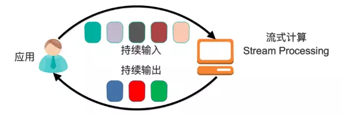

# 流式计算新贵Kafka Stream设计详解 (作者: 郭俊)

> 本文介绍了 Kafka Stream 的背景，如 Kafka Stream 是什么，什么是流式计算，以及为什么要有 Kafka Stream。接着介绍了 Kafka Stream 的整体架构、并行模型、状态存储以及主要的两种数据集 KStream 和 KTable。然后分析了 Kafka Stream 如何解决流式系统中的关键问题，如时间定义、窗口操作、Join 操作、聚合操作，以及如何处理乱序和提供容错能力。最后结合示例讲解了如何使用 Kafka Stream。


## Kafka Stream 背景  
**1. Kafka Stream 是什么**
Kafka Stream 是 Apache Kafka 从 0.10 版本引入的一个新 Feature。它提供了对存储于 Kafka 内的数据进行流式处理和分析的功能。

Kafka Stream 的特点如下：

> * Kafka Stream 提供了一个非常简单而轻量的 Library，它可以非常方便地嵌入任意 Java 应用中，也可以任意方式打包和部署
> * 除了 Kafka 外，无任何外部依赖
> * 充分利用 Kafka 分区机制实现水平扩展和顺序性保证
> * 通过可容错的 state store 实现高效的状态操作（如 windowed join 和 aggregation）
> * 支持正好一次处理语义
> * 提供记录级的处理能力，从而实现毫秒级的低延迟
> * 支持基于事件时间的窗口操作，并且可处理晚到的数据（late arrival of records）
> * 同时提供底层的处理原语 Processor（类似于 Storm 的 spout 和 bolt），以及高层抽象的 DSL（类似于 Spark 的 map/group/reduce）

**2. 什么是流式计算**

一般流式计算会与批量计算相比较。在流式计算模型中，输入是持续的，可以认为在时间上是无界的，也就意味着，永远拿不到全量数据去做计算。同时，计算结果是持续输出的，也即计算结果在时间上也是无界的。流式计算一般对实时性要求较高，同时一般是先定义目标计算，然后数据到来之后将计算逻辑应用于数据。同时为了提高计算效率，往往尽可能采用增量计算代替全量计算。



批量处理模型中，一般先有全量数据集，然后定义计算逻辑，并将计算应用于全量数据。特点是全量计算，并且计算结果一次性全量输出。


**3. 为什么要有 Kafka Stream**

当前已经有非常多的流式处理系统，最知名且应用最多的开源流式处理系统有 Spark Streaming 和 Apache Storm。Apache Storm 发展多年，应用广泛，提供记录级别的处理能力，当前也支持 SQL on Stream。而 Spark Streaming 基于 Apache Spark，可以非常方便与图计算，SQL 处理等集成，功能强大，对于熟悉其它 Spark 应用开发的用户而言使用门槛低。另外，目前主流的 Hadoop 发行版，如 MapR，Cloudera 和 Hortonworks，都集成了 Apache Storm 和 Apache Spark，使得部署更容易。

既然 Apache Spark 与 Apache Storm 拥用如此多的优势，那为何还需要 Kafka Stream 呢？笔者认为主要有如下原因。

第一，Spark 和 Storm 都是流式处理框架，而 Kafka Stream 提供的是一个基于 Kafka 的流式处理类库。框架要求开发者按照特定的方式去开发逻辑部分，供框架调用。开发者很难了解框架的具体运行方式，从而使得调试成本高，并且使用受限。而 Kafka Stream 作为流式处理类库，直接提供具体的类给开发者调用，整个应用的运行方式主要由开发者控制，方便使用和调试。


第二，虽然 Cloudera 与 Hortonworks 方便了 Storm 和 Spark 的部署，但是这些框架的部署仍然相对复杂。而 Kafka Stream 作为类库，可以非常方便的嵌入应用程序中，它对应用的打包和部署基本没有任何要求。更为重要的是，Kafka Stream 充分利用了 Kafka 的分区机制和 Consumer 的 Rebalance 机制，使得 Kafka Stream 可以非常方便的水平扩展，并且各个实例可以使用不同的部署方式。

具体来说，每个运行 Kafka Stream 的应用程序实例都包含了 Kafka Consumer 实例，多个同一应用的实例之间并行处理数据集。而不同实例之间的部署方式并不要求一致，比如部分实例可以运行在 Web 容器中，部分实例可运行在 Docker 或 Kubernetes 中。

第三，就流式处理系统而言，基本都支持 Kafka 作为数据源。例如 Storm 具有专门的 kafka-spout，而 Spark 也提供专门的 spark-streaming-kafka 模块。事实上，Kafka 基本上是主流的流式处理系统的标准数据源。换言之，大部分流式系统中都已部署了 Kafka，此时使用 Kafka Stream 的成本非常低。

第四，使用 Storm 或 Spark Streaming 时，需要为框架本身的进程预留资源，如 Storm 的 supervisor 和 Spark on YARN 的 node manager。即使对于应用实例而言，框架本身也会占用部分资源，如 Spark Streaming 需要为 shuffle 和 storage 预留内存。

第五，由于 Kafka 本身提供数据持久化，因此 Kafka Stream 提供滚动部署和滚动升级以及重新计算的能力。

第六，由于 Kafka Consumer Rebalance 机制，Kafka Stream 可以在线动态调整并行度。

## Kafka Stream 架构  
**1. Kafka Stream 整体架构**

Kafka Stream 的整体架构图如下。


目前（Kafka 0.11.0.0）Kafka Stream 的数据源只能如上图所示是 Kafka。但是处理结果并不一定要如上图所示输出到 Kafka。实际上 KStream 和 Ktable 的实例化都需要指定 Topic。

```bash
KStream<String, String> stream = builder.stream("words-stream");

KTable<String, String> table = builder.table("words-table", "words-store");
```

另外，上图中的 Consumer 和 Producer 并不需要开发者在应用中显示实例化，而是由 Kafka Stream 根据参数隐式实例化和管理，从而降低了使用门槛。开发者只需要专注于开发核心业务逻辑，也即上图中 Task 内的部分。

**2. Processor Topology**

方执行。它与 Storm 的 Topology 和 Spark 的 DAG 类似，都定义了数据在各个处理单元（在 Kafka Stream 中被称作 Processor）间的流动方式，或者说定义了数据的处理逻辑。

下面是一个 Processor 的示例，它实现了 Word Count 功能，并且每秒输出一次结果。

```java
public class WordCountProcessor implements Processor<String, String> {

  private ProcessorContext context;
  private KeyValueStore<String, Integer> kvStore;

  @SuppressWarnings("unchecked")
  @Override
  public void init(ProcessorContext context) {
    this.context = context;
    this.context.schedule(1000);
    this.kvStore = (KeyValueStore<String, Integer>) context.getStateStore("Counts");
  }

  @Override
  public void process(String key, String value) {
    Stream.of(value.toLowerCase().split(" ")).forEach((String word) -> {
      Optional<Integer> counts = Optional.ofNullable(kvStore.get(word));
      int count = counts.map(wordcount -> wordcount + 1).orElse(1);
      kvStore.put(word, count);
    });
  }

  @Override
  public void punctuate(long timestamp) {
    KeyValueIterator<String, Integer> iterator = this.kvStore.all();
    iterator.forEachRemaining(entry -> {
      context.forward(entry.key, entry.value);
      this.kvStore.delete(entry.key);
    });
    context.commit();
  }

  @Override
  public void close() {
    this.kvStore.close();
  }

}
```

从上述代码中可见

> * process 定义了对每条记录的处理逻辑，也印证了 Kafka 可具有记录级的数据处理能力。
> * context.scheduler 定义了 punctuate 被执行的周期，从而提供了实现窗口操作的能力。
> * context.getStateStore 提供的状态存储为有状态计算（如窗口，聚合）提供了可能。

**3.Kafka Stream 并行模型**

Kafka Stream 的并行模型中，最小粒度为 Task，而每个 Task 包含一个特定子 Topology 的所有 Processor。因此每个 Task 所执行的代码完全一样，唯一的不同在于所处理的数据集互补。这一点跟 Storm 的 Topology 完全不一样。Storm 的 Topology 的每一个 Task 只包含一个 Spout 或 Bolt 的实例。因此 Storm 的一个 Topology 内的不同 Task 之间需要通过网络通信传递数据，而 Kafka Stream 的 Task 包含了完整的子 Topology，所以 Task 之间不需要传递数据，也就不需要网络通信。这一点降低了系统复杂度，也提高了处理效率。

如果某个 Stream 的输入 Topic 有多个 (比如 2 个 Topic，1 个 Partition 数为 4，另一个 Partition 数为 3)，则总的 Task 数等于 Partition 数最多的那个 Topic 的 Partition 数（max(4,3)=4）。这是因为 Kafka Stream 使用了 Consumer 的 Rebalance 机制，每个 Partition 对应一个 Task。

下图展示了在一个进程（Instance）中以 2 个 Topic（Partition 数均为 4）为数据源的 Kafka Stream 应用的并行模型。从图中可以看到，由于 Kafka Stream 应用的默认线程数为 

1 . 所以 4 个 Task 全部在一个线程中运行。


为了充分利用多线程的优势，可以设置 Kafka Stream 的线程数。下图展示了线程数为 2 时的并行模型。


前文有提到，Kafka Stream 可被嵌入任意 Java 应用（理论上基于 JVM 的应用都可以）中，下图展示了在同一台机器的不同进程中同时启动同一 Kafka Stream 应用时的并行模型。注意，这里要保证两个进程的 StreamsConfig.APPLICATION_ID_CONFIG 完全一样。因为 Kafka Stream 将 APPLICATION_ID_CONFI 作为隐式启动的 Consumer 的 Group ID。只有保证 APPLICATION_ID_CONFI 相同，才能保证这两个进程的 Consumer 属于同一个 Group，从而可以通过 Consumer Rebalance 机制拿到互补的数据集。


既然实现了多进程部署，可以以同样的方式实现多机器部署。该部署方式也要求所有进程的 APPLICATION_ID_CONFIG 完全一样。从图上也可以看到，每个实例中的线程数并不要求一样。但是无论如何部署，Task 总数总会保证一致。


注意：Kafka Stream 的并行模型，非常依赖于《Kafka 设计解析（一）- Kafka 背景及架构介绍》一文中介绍的 Kafka 分区机制和《Kafka 设计解析（四）- Kafka Consumer 设计解析》中介绍的 Consumer 的 Rebalance 机制。强烈建议不太熟悉这两种机制的朋友，先行阅读这两篇文章。

这里对比一下 Kafka Stream 的 Processor Topology 与 Storm 的 Topology。

> * Storm 的 Topology 由 Spout 和 Bolt 组成，Spout 提供数据源，而 Bolt 提供计算和数据导出。Kafka Stream 的 Processor Topology 完全由 Processor 组成，因为它的数据固定由 Kafka 的 Topic 提供。

> *  Storm 的不同 Bolt 运行在不同的 Executor 中，很可能位于不同的机器，需要通过网络通信传输数据。而 Kafka Stream 的 Processor Topology 的不同 Processor 完全运行于同一个 Task 中，也就完全处于同一个线程，无需网络通信。

> * Storm 的 Topology 可以同时包含 Shuffle 部分和非 Shuffle 部分，并且往往一个 Topology 就是一个完整的应用。而 Kafka Stream 的一个物理 Topology 只包含非 Shuffle 部分，而 Shuffle 部分需要通过 through 操作显示完成，该操作将一个大的 Topology 分成了 2 个子 Topology。

> * Storm 的 Topology 内，不同 Bolt/Spout 的并行度可以不一样，而 Kafka Stream 的子 Topology 内，所有 Processor 的并行度完全一样。

> * Storm 的一个 Task 只包含一个 Spout 或者 Bolt 的实例，而 Kafka Stream 的一个 Task 包含了一个子 Topology 的所有 Processor。

**4. KTable vs. KStream**

KTable 和 KStream 是 Kafka Stream 中非常重要的两个概念，它们是 Kafka 实现各种语义的基础。因此这里有必要分析下二者的区别。

KStream 是一个数据流，可以认为所有记录都通过 Insert only 的方式插入进这个数据流里。而 KTable 代表一个完整的数据集，可以理解为数据库中的表。

由于每条记录都是 Key-Value 对，这里可以将 Key 理解为数据库中的 Primary Key，而 Value 可以理解为一行记录。可以认为 KTable 中的数据都是通过 Update only 的方式进入的。也就意味着，如果 KTable 对应的 Topic 中新进入的数据的 Key 已经存在，那么从 KTable 只会取出同一 Key 对应的最后一条数据，相当于新的数据更新了旧的数据。

以下图为例，假设有一个 KStream 和 KTable，基于同一个 Topic 创建，并且该 Topic 中包含如下图所示 5 条数据。此时遍历 KStream 将得到与 Topic 内数据完全一样的所有 5 条数据，且顺序不变。而此时遍历 KTable 时，因为这 5 条记录中有 3 个不同的 Key，所以将得到 3 条记录，每个 Key 对应最新的值，并且这三条数据之间的顺序与原来在 Topic 中的顺序保持一致。这一点与 Kafka 的日志 compact 相同。


此时如果对该 KStream 和 KTable 分别基于 key 做 Group，对 Value 进行 Sum，得到的结果将会不同。对 KStream 的计算结果是<Jack，4>，<Lily，7>，<Mike，4>。而对 Ktable 的计算结果是<Mike，4>，<Jack，3>，<Lily，5>。

**5. State store**

流式处理中，部分操作是无状态的，例如过滤操作（Kafka Stream DSL 中用 filer 方法实现）。而部分操作是有状态的，需要记录中间状态，如 Window 操作和聚合计算。State store 被用来存储中间状态。它可以是一个持久化的 Key-Value 存储，也可以是内存中的 HashMap，或者是数据库。Kafka 提供了基于 Topic 的状态存储。

Topic 中存储的数据记录本身是 Key-Value 形式的，同时 Kafka 的 log compaction 机制可对历史数据做 compact 操作，保留每个 Key 对应的最后一个 Value，从而在保证 Key 不丢失的前提下，减少总数据量，从而提高查询效率。

构造 KTable 时，需要指定其 state store name。默认情况下，该名字也即用于存储该 KTable 的状态的 Topic 的名字，遍历 KTable 的过程，实际就是遍历它对应的 state store，或者说遍历 Topic 的所有 key，并取每个 Key 最新值的过程。为了使得该过程更加高效，默认情况下会对该 Topic 进行 compact 操作。

另外，除了 KTable，所有状态计算，都需要指定 state store name，从而记录中间状态。

## Kafka Stream 如何解决流式系统中关键问题  

**1. 时间**

在流式数据处理中，时间是数据的一个非常重要的属性。从 Kafka 0.10 开始，每条记录除了 Key 和 Value 外，还增加了 timestamp 属性。目前 Kafka Stream 支持三种时间

> * 事件发生时间。事件发生的时间，包含在数据记录中。发生时间由 Producer 在构造 ProducerRecord 时指定。并且需要 Broker 或者 Topic 将 message.timestamp.type 设置为 CreateTime（默认值）才能生效。

> * 消息接收时间，也即消息存入 Broker 的时间。当 Broker 或 Topic 将 message.timestamp.type 设置为 LogAppendTime 时生效。此时 Broker 会在接收到消息后，存入磁盘前，将其 timestamp 属性值设置为当前机器时间。一般消息接收时间比较接近于事件发生时间，部分场景下可代替事件发生时间。

> * 消息处理时间，也即 Kafka Stream 处理消息时的时间。

*注：Kafka Stream 允许通过实现 org.apache.kafka.streams.processor.TimestampExtractor 接口自定义记录时间。*

**2. 窗口**

前文提到，流式数据是在时间上无界的数据。而聚合操作只能作用在特定的数据集，也即有界的数据集上。因此需要通过某种方式从无界的数据集上按特定的语义选取出有界的数据。窗口是一种非常常用的设定计算边界的方式。不同的流式处理系统支持的窗口类似，但不尽相同。

Kafka Stream 支持的窗口如下。

1. Hopping Time Window 该窗口定义如下图所示。它有两个属性，一个是 Window size，一个是 Advance interval。Window size 指定了窗口的大小，也即每次计算的数据集的大小。而 Advance interval 定义输出的时间间隔。一个典型的应用场景是，每隔 5 秒钟输出一次过去 1 个小时内网站的 PV 或者 UV。


2. Tumbling Time Window 该窗口定义如下图所示。可以认为它是 Hopping Time Window 的一种特例，也即 Window size 和 Advance interval 相等。它的特点是各个 Window 之间完全不相交。


3. Sliding Window 该窗口只用于 2 个 KStream 进行 Join 计算时。该窗口的大小定义了 Join 两侧 KStream 的数据记录被认为在同一个窗口的最大时间差。假设该窗口的大小为 5 秒，则参与 Join 的 2 个 KStream 中，记录时间差小于 5 的记录被认为在同一个窗口中，可以进行 Join 计算。

4. Session Window 该窗口用于对 Key 做 Group 后的聚合操作中。它需要对 Key 做分组，然后对组内的数据根据业务需求定义一个窗口的起始点和结束点。一个典型的案例是，希望通过 Session Window 计算某个用户访问网站的时间。对于一个特定的用户（用 Key 表示）而言，当发生登录操作时，该用户（Key）的窗口即开始，当发生退出操作或者超时时，该用户（Key）的窗口即结束。窗口结束时，可计算该用户的访问时间或者点击次数等。

**3. Join**

Kafka Stream 由于包含 KStream 和 Ktable 两种数据集，因此提供如下 Join 计算

> * KTable Join KTable 结果仍为 KTable。任意一边有更新，结果 KTable 都会更新。

> * KStream Join KStream 结果为 KStream。必须带窗口操作，否则会造成 Join 操作一直不结束。

> * KStream Join KTable / GlobakKTable 结果为 KStream。只有当 KStream 中有新数据时，才会触发 Join 计算并输出结果。KStream 无新数据时，KTable 的更新并不会触发 Join 计算，也不会输出数据。并且该更新只对下次 Join 生效。一个典型的使用场景是，KStream 中的订单信息与 KTable 中的用户信息做关联计算。


对于 Join 操作，如果要得到正确的计算结果，需要保证参与 Join 的 KTable 或 KStream 中 Key 相同的数据被分配到同一个 Task。具体方法是

> * 参与 Join 的 KTable 或 KStream 的 Key 类型相同（实际上，业务含意也应该相同）

> * 参与 Join 的 KTable 或 KStream 对应的 Topic 的 Partition 数相同Partitioner 策略的最终结果等效（实现不需要完全一样，只要效果一样即可），也即 Key 相同的情况下，被分配到 ID 相同的 Partition 内

> * 如果上述条件不满足，可通过调用如下方法使得它满足上述条件。


```java
KStream<K, V> through(Serde<K> keySerde, Serde<V> valSerde, StreamPartitioner<K, V> partitioner, String topic)
```

**4. 聚合与乱序处理**

聚合操作可应用于 KStream 和 KTable。当聚合发生在 KStream 上时必须指定窗口，从而限定计算的目标数据集。

需要说明的是，聚合操作的结果肯定是 KTable。因为 KTable 是可更新的，可以在晚到的数据到来时（也即发生数据乱序时）更新结果 KTable。

这里举例说明。假设对 KStream 以 5 秒为窗口大小，进行 Tumbling Time Window 上的 Count 操作。并且 KStream 先后出现时间为 1 秒, 3 秒, 5 秒的数据，此时 5 秒的窗口已达上限，Kafka Stream 关闭该窗口，触发 Count 操作并将结果 3 输出到 KTable 中（假设该结果表示为<1-5,3>）。若 1 秒后，又收到了时间为 2 秒的记录，由于 1-5 秒的窗口已关闭，若直接抛弃该数据，则可认为之前的结果<1-5,3>不准确。

而如果直接将完整的结果<1-5,4>输出到 KStream 中，则 KStream 中将会包含该窗口的 2 条记录，<1-5,3>, <1-5,4>，也会存在肮数据。因此 Kafka Stream 选择将聚合结果存于 KTable 中，此时新的结果<1-5,4>会替代旧的结果<1-5,3>。用户可得到完整的正确的结果。

这种方式保证了数据准确性，同时也提高了容错性。

但需要说明的是，Kafka Stream 并不会对所有晚到的数据都重新计算并更新结果集，而是让用户设置一个 retention period，将每个窗口的结果集在内存中保留一定时间，该窗口内的数据晚到时，直接合并计算，并更新结果 KTable。超过 retention period 后，该窗口结果将从内存中删除，并且晚到的数据即使落入窗口，也会被直接丢弃。

**5. 容错**

Kafka Stream 从如下几个方面进行容错

> * 高可用的 Partition 保证无数据丢失。每个 Task 计算一个 Partition，而 Kafka 数据复制机制保证了 Partition 内数据的高可用性，故无数据丢失风险。同时由于数据是持久化的，即使任务失败，依然可以重新计算。

> * 状态存储实现快速故障恢复和从故障点继续处理。对于 Join 和聚合及窗口等有状态计算，状态存储可保存中间状态。即使发生 Failover 或 Consumer Rebalance，仍然可以通过状态存储恢复中间状态，从而可以继续从 Failover 或 Consumer Rebalance 前的点继续计算。

> * KTable 与 retention period 提供了对乱序数据的处理能力。

## Kafka Stream 应用示例  

下面结合一个案例来讲解如何开发 Kafka Stream 应用。本例完整代码可从作者 Github 获取。

订单 KStream（名为 orderStream），底层 Topic 的 Partition 数为 3，Key 为用户名，Value 包含用户名，商品名，订单时间，数量。用户 KTable（名为 userTable），底层 Topic 的 Partition 数为 3，Key 为用户名，Value 包含性别，地址和年龄。商品 KTable（名为 itemTable），底层 Topic 的 Partition 数为 6，Key 为商品名，价格，种类和产地。现在希望计算每小时购买产地与自己所在地相同的用户总数。

首先由于希望使用订单时间，而它包含在 orderStream 的 Value 中，需要通过提供一个实现 TimestampExtractor 接口的类从 orderStream 对应的 Topic 中抽取出订单时间。

```java
public class OrderTimestampExtractor implements TimestampExtractor {

  @Override
  public long extract(ConsumerRecord<Object, Object> record) {
    if(record instanceof Order) {
      return ((Order)record).getTS();
    } else {
      return 0;
    }
  }
}
```

接着通过将 orderStream 与 userTable 进行 Join，来获取订单用户所在地。由于二者对应的 Topic 的 Partition 数相同，且 Key 都为用户名，再假设 Producer 往这两个 Topic 写数据时所用的 Partitioner 实现相同，则此时上文所述 Join 条件满足，可直接进行 Join。

```java
orderUserStream = orderStream
    .leftJoin(userTable, 
         // 该 lamda 表达式定义了如何从 orderStream 与 userTable 生成结果集的 Value
        (Order order, User user) -> OrderUser.fromOrderUser(order, user), 
         // 结果集 Key 序列化方式
        Serdes.String(),
         // 结果集 Value 序列化方式
         SerdesFactory.serdFrom(Order.class))
    .filter((String userName, OrderUser orderUser) -> orderUser.userAddress != null)
```

从上述代码中，可以看到，Join 时需要指定如何从参与 Join 双方的记录生成结果记录的 Value。Key 不需要指定，因为结果记录的 Key 与 Join Key 相同，故无须指定。Join 结果存于名为 orderUserStream 的 KStream 中。

接下来需要将 orderUserStream 与 itemTable 进行 Join，从而获取商品产地。此时 orderUserStream 的 Key 仍为用户名，而 itemTable 对应的 Topic 的 Key 为产品名，并且二者的 Partition 数不一样，因此无法直接 Join。此时需要通过 through 方法，对其中一方或双方进行重新分区，使得二者满足 Join 条件。这一过程相当于 Spark 的 Shuffle 过程和 Storm 的 FieldGrouping。

```java
orderUserStrea
    .through(
        // Key 的序列化方式
        Serdes.String(),
        // Value 的序列化方式 
        SerdesFactory.serdFrom(OrderUser.class), 
        // 重新按照商品名进行分区，具体取商品名的哈希值，然后对分区数取模
        (String key, OrderUser orderUser, int numPartitions) -> (orderUser.getItemName().hashCode() & 0x7FFFFFFF) % numPartitions, 
        "orderuser-repartition-by-item")
    .leftJoin(itemTable, (OrderUser orderUser, Item item) -> OrderUserItem.fromOrderUser(orderUser, item), Serdes.String(), SerdesFactory.serdFrom(OrderUser.class))
```

从上述代码可见，through 时需要指定 Key 的序列化器，Value 的序列化器，以及分区方式和结果集所在的 Topic。这里要注意，该 Topic（orderuser-repartition-by-item）的 Partition 数必须与 itemTable 对应 Topic 的 Partition 数相同，并且 through 使用的分区方法必须与 iteamTable 对应 Topic 的分区方式一样。经过这种 through 操作，orderUserStream 与 itemTable 满足了 Join 条件，可直接进行 Join。

## 总结  

> * Kafka Stream 的并行模型完全基于 Kafka 的分区机制和 Rebalance 机制，实现了在线动态调整并行度

> * 同一 Task 包含了一个子 Topology 的所有 Processor，使得所有处理逻辑都在同一线程内完成，避免了不必的网络通信开销，从而提高了效率。

> * through 方法提供了类似 Spark 的 Shuffle 机制，为使用不同分区策略的数据提供了 Join 的可能
> * log compact 提高了基于 Kafka 的 state store 的加载效率

> * state store 为状态计算提供了可能

> * 基于 offset 的计算进度管理以及基于 state store 的中间状态管理为发生 Consumer rebalance 或 Failover 时从断点处继续处理提供了可能，并为系统容错性提供了保障

> * KTable 的引入，使得聚合计算拥用了处理乱序问题的能力