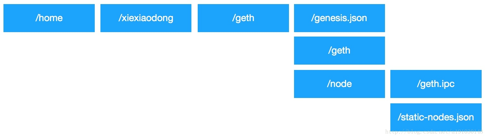
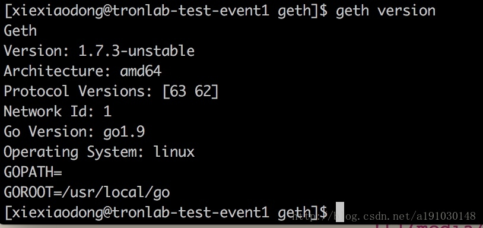
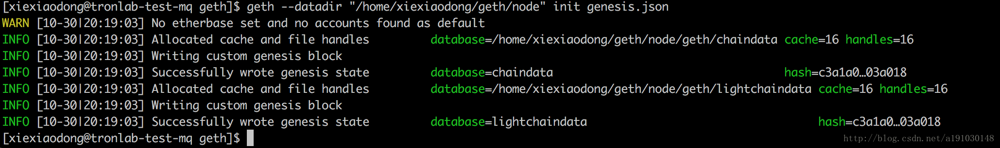
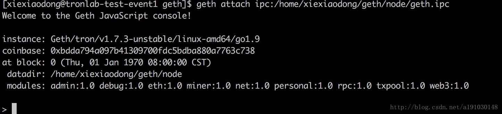
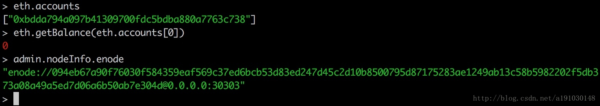
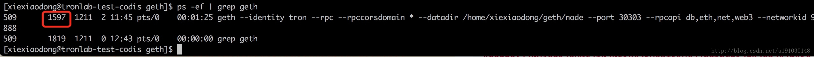
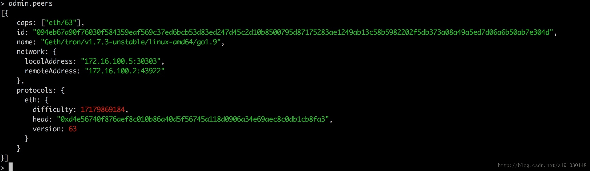

# go-ethereum 部署私有链

本文将介绍如果利用以太坊开源项目搭建私有链,本文作者：http://blog.csdn.net/a191030148/article/details/78343005

## 服务器
<table style="width:100%">
<tr>
<th>代号</th>
<th>内网 IP</th>
<th>操作目录</th>
<th>说明</th>
</tr>
<tr>
<td align="center">event1</td>
<td align="center">172.16.100.1</td>
<td align="center">/home/xiexiaodong/geth</td>
<td align="center">作为私有链第一个节点</td>
</tr>

<tr>
<td align="center">codis</td>
<td align="center">172.16.100.5</td>
<td align="center">/home/xiexiaodong/geth</td>
<td align="center">作为私有链第二个节点</td>
</tr>

<tr>
<td align="center">mq</td>
<td align="center">172.16.100.6</td>
<td align="center">/home/xiexiaodong/geth</td>
<td align="center">作为私有链第三个节点</td>
</tr>
</table>

三台服务器中，相关文件的最终目录结构参考：



## 上传 geth 可执行程序

在 $GOPATH/src/github.com/ethereum/go-ethereum 目录下执行 go build -o geth ./cmd/geth/ 生成 geth 可执行程序，然后将生成的 geth 可执行程序上传到这三台服务器的操作目录下，上传后的全路径为：/home/xiexiaodong/geth/geth。 

上传命令如下：

```bash
scp geth xiexiaodong@172.16.100.1:/home/xiexiaodong/geth/
```

然后添加环境变量，执行 vi ~/.bash_profile，添加下面代码：

```bash
export GETH=/home/xiexiaodong/geth
export PATH=$PATH:$GETH
```

保存退出后执行 source ~/.bash_profile 使之生效。执行 geth version 查看是否生效：



## 第一台服务器节点

创建创世区块配置文件

创建 genesis.json 文件

```json
{
    "config": {
        "chainId": 0,
        "homesteadBlock": 0,
        "eip155Block": 0,
        "eip158Block": 0
    },
    "alloc": {
        "0xbdda794a097b41309700fdc5bdba880a7763c738": {
            "balance": "1000"
        }
    },
    "nonce": "0x0000000000000042",
    "difficulty": "0x020000",
    "mixhash": "0x0000000000000000000000000000000000000000000000000000000000000000",
    "coinbase": "0x0000000000000000000000000000000000000000",
    "timestamp": "0x00",
    "parentHash": "0x0000000000000000000000000000000000000000000000000000000000000000",
    "extraData": "",
    "gasLimit": "0xffffffff"
}
```

参数说明：

<table style="width:100%">
<tr>
<th>描述</th>
<th>描述</th>
</tr>

<tr>
<th>alloc</th>
<td>用来预置账号以及账号的以太币数量。因为私有链挖矿比较容易，所以不需要预置有币的账号。</td>
</tr>
<tr>
<th>nonce</th>
<td>生成的工作证明的散列。注意它和 mixhash 的设置需要满足以太坊的 Yellow paper,4.3.4.Block Header Validity,（44）章节所描述的条件。</td>
</tr>
<tr>
<th>difficulty</th>
<td>设置当前区块的难度，如果难度过大，CPU 挖矿就越难，这里设置较小难度，方便 CPU 挖矿，十六进制。</td>
</tr>
<tr>
<th>mixhash</th>
<td>与 nonce 配合用于挖矿，由上一个区块的一部分生成的 hash。注意它和 nonce 的设置需要满足以太坊的 Yellow paper,4.3.4.Block Header Validity,（44）章节所描述的条件。</td>
</tr>
<tr>
<th>coinbase</th>
<td>矿工的账号，可以在创建私链之前导入已经创建好的账号。</td>
</tr>
<tr>
<th>parentHash</th>
<td>上一个区块的 hash 值，创始区块没有上一个区块，所以设置为 0。</td>
</tr>
<tr>
<th>extraData</th>
<td>附加信息，可以填写任意信息，已达到私有链的个性化，可以加入自己的名字等。</td>
</tr>
<tr>
<th>gasLimit</th>
<td>	该值设置对 GAS 的消耗总量限制，用来限制区块能包含的交易信息总和，私有链可以设置为最大值。</td>
</tr>
</table>

### 初始化

创建数据存放地址并初始化创世块，执行：

```bash
geth --datadir "/home/xiexiaodong/geth/node" init genesis.json
```




这里指定了 30303 作为监听端口号.

### 查看信息

执行下面命令连接 geth console：

```bash
geth attach ipc:/home/xiexiaodong/geth/node/geth.ipc
```



执行 admin.nodeInfo.enode 查看当前节点 enode 值：




记下 enode 值，将 @ 后面换成本机 IP:30303，将会在后面操作中使用该值：

```json
[
"enode://094eb67a90f76030f584359eaf569c37ed6bcb53d83ed247d45c2d10b8500795d87175283ae1249ab13c58b5982202f5db373a08a49a5ed7d06a6b50ab7e304d@172.16.100.2:30303"
]
```

## 第二台服务器节点

### 创建创世区块配置文件

同第一台服务器的创建创世区块配置文件操作一样，genesis.json 内容也完全相同。

### 初始化

同第一台服务器节点初始化操作一样。

### 启动节点

同第一台服务器节点初始化操作一样。

### 查看信息

执行下面命令连接 geth：

```bash
geth attach ipc:/home/xiexiaodong/geth/node/geth.ipc
```

执行 admin.peers 查看集群信息，此时为空。

### 添加静态节点文件

在第二台服务器的 geth datadir 目录下添加 static-nodes.json（绝对路径参考：/home/xiexiaodong/geth/node/static-nodes.json） 文件，内容为上面记录的 enode 值：


```json
[
"enode://094eb67a90f76030f584359eaf569c37ed6bcb53d83ed247d45c2d10b8500795d87175283ae1249ab13c58b5982202f5db373a08a49a5ed7d06a6b50ab7e304d@172.16.100.2:30303"
]
```

重启 geth，执行 ps -ef | grep geth 查看 geth pid 为 1597：



然后执行 kill -9 1597 结束进程，然后执行 rm -rf nohup.out 删除当前目录的 nohup.out 文件，再执行启动节点命令：

```bash
nohup geth --nodiscover --maxpeers 3 --identity "tron"  --rpc  --rpccorsdomain "*" --datadir "/home/xiexiaodong/geth/node" --port "30303"  --rpcapi "db,eth,net,web3" --networkid 98888 &
```

然后在任意台服务器 geth console 中执行 admin.peers 查看集群信息。



## 第三台服务器节点

和第二台服务器节点操作一致，static-nodes.json 中需要添加第一台和第二台服务器的 encode 值，同时将第三台服务器的 enode 值追加到第二台服务器上的 static-nodes.json 中后重启第二台服务器的 geth。全部完成后，在任意台服务器 geth console 中执行 admin.peers 都可以看到可以和其他两台服务器互连。

## 挖矿测试

在这三台服务器上分别执行下面操作： 

1. 查看当前节点账号：eth.accounts，为空； 

2. 添加一个账号：personal.newAccount('123456')。123456 为密码； 

3. 查看第一个账号（下标为 0）的余额：eth.getBalance(eth.accounts[0])。此时余额为 0； 

4. 查看此时区块链上的块数：eth.blockNumber。此时为块数 0； 

5. 开始挖矿：miner.start()。每一个节点第一次启动挖矿，需要生成相关数据，所以慢一些，挖矿动作会增加挖矿所在节点的第一个账号的余额（可以通过命令设置奖励到其他账号：miner.setEtherbase(eth.accounts[1])），同时也会增加整个区块链的区块数。 

6. 执行一段时间（至少等到出现第一个小锤子图标）后，结束挖矿：miner.stop()。执行步骤 3 和 4 查看有何变化。

执行 eth.getBlock(160) 查看区块号是 160 的区块信息：


参数说明：

<table style="width:100%">
<tr>
<th>描述</th>
<th>描述</th>
</tr>

<tr>
<th>difficulty</th>
<td>挖矿难度，这里转化为 10 进制，等于”0x400”，后面区块难度会随着区块高度升高而提高</td>
</tr>
<tr>
<th>extraData</th>
<td>当前区块附加信息，若创世区块该值为空，在第二个区块中会保存，创建该私有链时的 geth，go，及操作系统版本，保存信息为第一个挖到该区块的矿工信息</td>
</tr>
<tr>
<th>gasLimit</th>
<td>十进制的 gasLimit 值,会随之区块高度提高而提高</td>
</tr>
<tr>
<th>gasUsed</th>
<td>gas 花费，在以太坊中交易和部署智能合约会消耗 gas，暂时可以理解为以太币</td>
</tr>
<tr>
<th>hash</th>
<td>当前区块hash值</td>
</tr>
<tr>
<th>logsBloom</th>
<td>保存当前区块日志</td>
</tr>
<tr>
<th>miner</th>
<td>挖到该区块的矿工地址</td>
</tr>
<tr>
<th>mixHash</th>
<td>与 nonce 配合用于挖矿，由上一个区块的一部分生成的 hash</td>
</tr>
<tr>
<th>nonce</th>
<td>工作量证明</td>
</tr>
<tr>
<th>number</th>
<td>当前区块高度</td>
</tr>
<tr>
<th>parentHash</th>
<td>上一个区块 hash 值</td>
</tr>
<tr>
<th>receiptsRoot</th>
<td>块的收益树根结果</td>
</tr>
<tr>
<th>sha3Uncles</th>
<td>对叔区块进行 hash 运算的结果</td>
</tr>
<tr>
<th>size</th>
<td>区块大小，以字节为单位</td>
</tr>
<tr>
<th>stateRoot</th>
<td>块的状态树根结果</td>
</tr>
<tr>
<th>timestamp</th>
<td>时间戳</td>
</tr>
<tr>
<th>totalDifficulty</th>
<td>达到该区块的难度总数</td>
</tr>

<tr>
<th>transactions</th>
<td>以数组的形式保存交易的 tx 值</td>
</tr>

<tr>
<th>transactionsRoot</th>
<td>交易的默克尔树根</td>
</tr>

<tr>
<th>uncles</th>
<td>以数组表示数区块的哈希</td>
</tr>
</table>