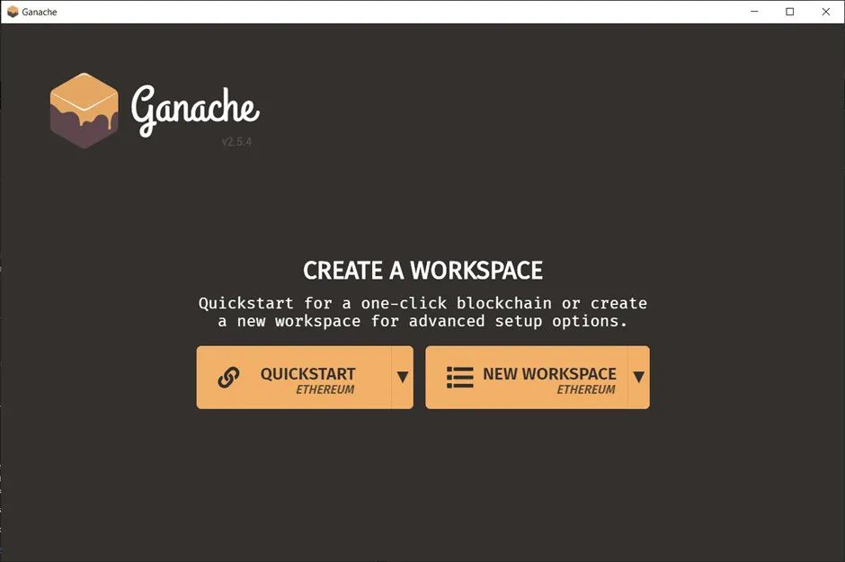
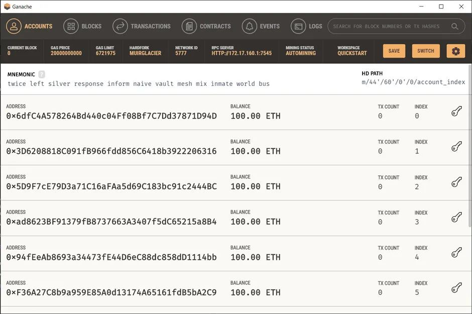
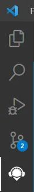
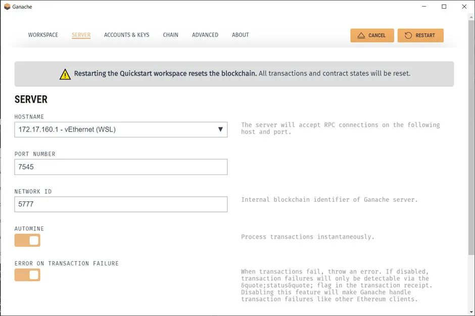
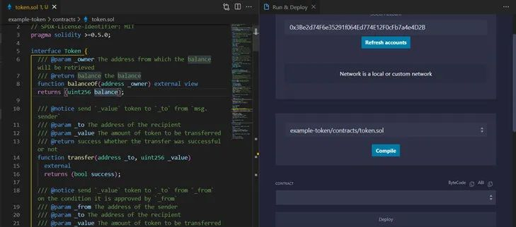
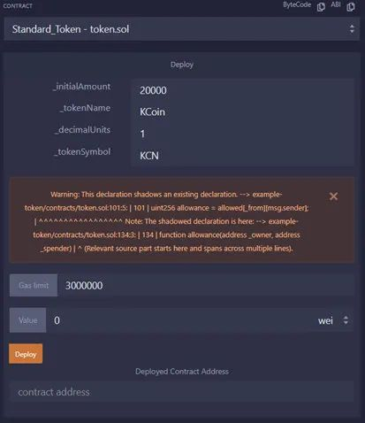
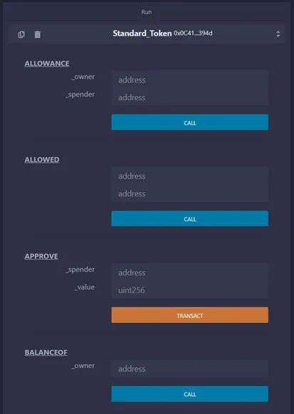

# 如何使用VSCode、Remix和TruffleSuite设置本地Solidity开发环境？

在以下几节中，我们将安装和设置Solidity的开发环境：Visual Studio CodeRemix ExtensionGanacheTruffle除了本教程，我们还将编写一个简单的ERC20项目来演示设置。Visual Studio CodeVSCode是一个由微软构建的代码编辑器，具有智

在以下几节中，我们将安装和设置Solidity的开发环境：

Visual Studio CodeRemix ExtensionGanacheTruffle

除了本教程，我们还将编写一个简单的ERC20项目来演示设置。

Visual Studio Code

VSCode是一个由微软构建的代码编辑器，具有智能感知等功能丰富的功能和大量的扩展。它是全球开发者社区最喜爱的开发工具。

如果还没有安装VS Code，可以直接从官方网站下载。

然后，我们可以通过安装由Juan Blanco制作的Solidity扩展来添加Solidity支持。

这个扩展将帮助我们突出Solidity语法以提高可读性和片段，并加快开发速度。

安装完成后，我们可以通过创建一个新文件夹来启动一个新项目，即：example-coin，并在项目中创建一个子文件夹contract。

example-coin |_ contracts

接下来，在合约文件夹名称下创建一个新合约token.sol。

现在在文件中输入ERC20。这将通过Solidity扩展触发一个片段，并为ERC20代币创建一个模板。为了简化本教程，将不深入研究代码。概括地说，代码基本上是ERC20合约的启动模板。

如果由于某些原因，我们无法生成代码片段，或者代码片段不能工作，我们可以参考GitHub存储库。

现在我们有了ERC20代币代码，让我们在下面几节中尝试运行它。

## Ganache

在测试我们的智能合约之前，我们将需要一个以太坊虚拟机(或EVM)来托管和运行我们的合约。要做到这一点，有两个选择，

使用公共测试网，比如Rinkeby, Ropsten自托管私有以太坊区块链

使用公共测试网的优点是它不需要配置。连接到它，我们就可以开始了。

然而，由于它仍然是一个公共网络，我们将需要测试网faucet来获得Ether，这是至关重要的，因为我们需要支付gas来部署我们的合约——有时它们可能会停止——我们将不得不等待服务重新上线。但是，在部署到主网之前，我们应该始终部署到公共测试网来测试我们的合约。

对于私有区块链，一切都在我们的控制之下。我们可以控制如何进行挖矿、所需的gas费用以及所有自定义设置。Ganache是可以为我们启动私有以太坊区块链的软件之一。

要安装Ganache，请访问Ganache官方网站从Truffle Suite下载软件。借助清晰的 UI，启动区块链也很容易，您只需启动应用程序并单击QUICKSTART 以启动一个新的私有以太坊区块链，其中 10 个帐户已经准备好进行测试。



  启动时 Ganache 中的界面




   启动区块链后在Ganache中的接口

这些测试账户最好的一点是，在将任何东西部署到主网之前，我们还可以将它们导入Metamask等流行的加密钱包进行端到端测试。

我们还可以通过区块、交易、合约、事件和日志来检查区块链的状态，让自己全面了解自己的测试环境，在这里可以轻松分析自己的智能联系人的触发器，这与在公共测试网中不同的是它充满了数以千计的其他开发人员的操作。

现在我们已经准备好了区块链，让我们在它上部署我们的智能合约，并尝试使用Remix扩展运行。

## Remix

Remix 是最受 Solidity 开发人员欢迎的 IDE，但我们不必因为使用VSCode就放弃它！Remix本身可以帮助我们在区块链上编译和部署一个合约，并提供一个便于测试的接口，比如一个按钮来触发具有不同参数的函数。

即使安装了Solidity扩展，VS Code本身也不能提供这些功能，但是我们可以通过在VSCode中安装Ethereum Remix扩展来结合这两个的优点。这个扩展是由官方以太坊基金会编码和维护的，所以Remix提供的功能也在这个扩展中。

要下载扩展，只需在扩展选项中搜索Ethereum Remix或从市场下载它。

我们可以使用 Remix 扩展来帮助我们运行example-coin我们刚刚编写的合约：




  侧边栏的Remix图标


单击Remix扩展选项。单击Run & Deploy，然后单击弹出菜单中的Activate。现在回到Ganache，按右上角的棕色设置图标。在server选项卡中，找到带有端口号的主机名并复制它





将主机名和端口号粘贴到Remix面板中，格式为http://:，对我来说，它应该是http://172.17.160.1:7545

确保我们的solidity文件是活动的，然后在Remix扩展按下compile。



两个面板都在工作区中处于活动状态


编译完智能合约后，我们可以使用自定义配置将代币部署到区块链，然后单击deploy。



编译后的UI

现在我们可以通过运行面板轻松地与智能合约进行交互。




这里列出了ABI中包含的函数

这是一种交互式的方式来测试我们的智能合约是否按照预期工作，就像我们在Remix IDE中所期望的那样。

但是手动测试每个函数是非常耗时的，而且很难为每一个小的更改包含每个用例，所以这只对快速开发有利。从长远来看，为了节省时间和精力，我们需要一个自动测试解决方案来帮助我们，而Truffle可以帮助我们解决这个问题。


## Truffle Suite

ruffle是一个自动测试工具和部署工具，可以帮助我们在提供需求的同时，促进我们的开发和部署过程。

Ganache也是Truffle Suite中的一款软件，现在我们可以使用其中的另一款产品，也就是Truffle本身。

要安装Truffle，我们需要先安装npm。如果我们没有，我们可以去NPM的网站，按照如何安装NPM的指南。

用npm安装Truffle很简单，只要输入命令即可。

```sh
npm install -g truffle
```


选项-g将全局启用Truffle，所以我们可以在系统中的任何地方使用它。

安装了Truffle之后，我们可以按照下面的步骤开始为我们的代币编写测试用例

打开智能合约的根文件夹，运行truffle init当出现以下响应提示时，选择N，因为我们已经准备好了合约。

```sh

contracts already exists in this directory…?Overwrite contracts? (y/N)

```

现在我们应该有一个如下的文件夹结构:

example-coin |_ contracts |_ token.sol |_ migrations |_ 1_initial_migration.js |_ test |_ .gitkeep |_ truffle-config.js

在test文件夹下创建一个新的文件token.test.js，并将下面的代码复制到该文件中。

```js
const Standard_Token = artifacts.require("Standard_Token"); 
contract("Standard_Token", (accounts) => { 
    it("should put 10000 token in the first account", async () => { 
        const token = await Standard_Token.deployed(); 
        const balance = await token.balanceOf(accounts[0]); 
        assert.equal(balance.toNumber(), 10000); }); 
        it("should transfer 100 token from the accounts[0] to accounts[1]", async () => { 
            const token = await Standard_Token.deployed(); 
            await token.transfer(accounts[1], 100, { from: accounts[0]}); 
            const balance = await token.balanceOf(accounts[1]); assert.equal(balance.toNumber(), 100); 
        }); 
    });
```

我在这里准备了两个测试，检查部署合约的地址是否确实收到了10000个代币，以及100个代币从一个地址转移到另一个地址是否成功。

现在我们需要对Truffle进行配置和部署，首先进入Truffle -config.js和 networks.development，取消注释，并将该字段更改为我们的Ganache配置，此时我们可以保持其他设置不变。


```js
networks: { 
    development: { 
        host: "192.168.48.1", // Localhost (default: none) 
        port: 7545, // Standard Ethereum port (default: none) 
        network_id: "*", // Any network (default: none) 
    } 
}
```


接下来，我们将教Truffle应该如何部署我们的合约，复制以下代码来替换1_initial_migration.js的内容。这段代码将合约部署到区块链上，并使用我们的参数调用构造函数。


```js
const Standard_Token = artifacts.require("Standard_Token"); 
module.exports = function (deployer) { 
    deployer.deploy(Standard_Token, 10000, "Example Coin", 1, "EPC"); 
};
```


现在我们可以在根目录运行truffle test，它会自动检测测试文件夹中的测试并为我们运行它们。我们还应该看到以下结果

Contract: Standard_Token ✓ should put 10000 token in the first account (118ms) ✓ should transfer 100 token from the accounts[0] to accounts[1] (696ms)2 passing (1s)

现在一切都准备好了，我们可以运行truffle migrate来部署链上的合约!


结论

这就是我如何在以太坊上建立智能合约的环境，但请注意，没有两个开发者是相同的，这只是作为我们的参考，我们应该找到我们觉得最舒服的设置。

Source：https://medium.com/better-programming/how-i-set-up-my-local-solidity-development-environment-with-vscode-remix-and-truffle-suite-addd20ef9c

