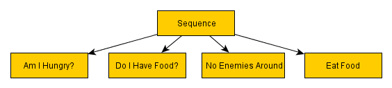
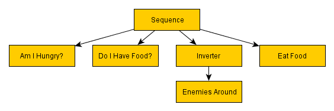
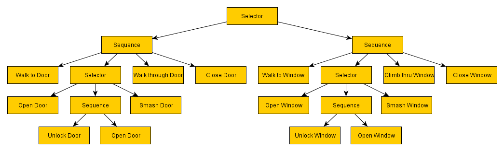

# 关于行为树的基础概念

行为树下，允许有平行的任务，这个任务可能是个状态机，多个状态机可以平行执行。在复杂的应用情景下，行为树的实现要比状态机简单。

从名字上看，behaviour tree，首先是个tree，这样就会有node，整棵tree代表一系列的组合。其实可以想象火车编组站，从北京始发的车，每到达一个城市，这个城市就是一个node，通过走不同的node，到达了不同的地方，也就提供了不同的功能。每帧更新不会都遍历一次整棵树，而是只更新当前正在进行处理的节点即可。

NodeCanvas是先实现了一个图（Graph）的数据结构，里面定义了节点，连接等对象。行为树是图的一个子类，行为树上的节点是图里节点的子类。

每个节点的状态定义了5种：

```bash
Failure = 0,
Success = 1,
Running = 2,
Resting = 3,
Error = 4,
```

从名字上来看，分别告诉父节点，自己执行的结果是失败，成功还是没执行完，或者正在重置状态，或者出错了。

行为树上节点的类型有：

三大类，分别是Composite，Decorator，Leaf。 是不是所有的行为树都必须实现这几类节点呢？

从名字上来看，

Composite定义了执行框架，最简单的就是Sequence，序列执行的节点流，如果一个节点执行失败，就返回，其余节点就不再执行，显然这种节点，对于完整性要求的事务非常合适。



和Sequence相似正好相反的是 Selector，这种框架是，当子节点只要有一个成功，就返回，其余节点不再执行。所以说，sequence是对所有子节点执行的and操作，selector是对所有子节点执行or操作。比如，你下班回家，准备进房间的时候，发现门锁着（一个节点，检查门是否锁着，锁着意味着进入失败），拿出一把钥匙（如果找到的话就成功），然后就可以进房间了，当然这个过程还有很多条件，比如，当前的钥匙不对，需要再试其他钥匙。


Decorator提供了转接功能，只能有一个子节点。负责对子节点的输出结果进行二次加工，再返回到父节点。例如子节点计算一个值，当这个值在什么区间内返回什么，超过区间返回别的。这种转接口就多了，比如总是返回true，或者总是返回false



leaf定义了具体的行为，也是承载主要功能的节点，不能有子节点。包括子树节点SubTree，单次行为节点Action，条件节点Condition，状态机节点FSM，激活的状态Enable/Disable，根节点转移RootSwitch等。最简单的实现，就是行走功能节点，驱动玩家在场景中行走。其实叶节点可以认为是函数，而composite和decorator就是调用这些函数的地方。



**参考：**

> http://www.gamasutra.com/blogs/ChrisSimpson/20140717/221339/Behavior_trees_for_AI_How_they_work.php

> 关于决策树和行为树的对比：

> http://gamedev.stackexchange.com/questions/51693/decision-tree-vs-behavior-tree

