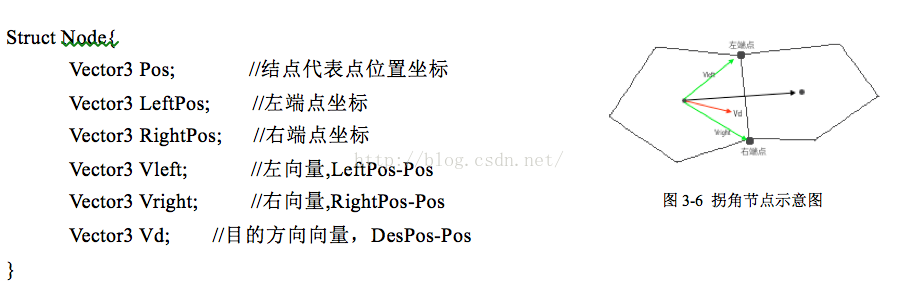

# 游戏中的AI算法总结与改进

作者原文地址:http://blog.csdn.net/cordova/article/details/51607407

## 参考文章：

> * http://games.sina.com.cn/zl/duanpian/2014-03-11/105973.shtml
> * http://www.oschina.net/translate/understanding-steering-behaviors-collision-avoidance?cmp
> * http://blog.csdn.net/ityuany/article/details/5509750

## 一. 我理解的人工智能的定义

人工智能（AI, Artificial Intelligent）,指的是通过算法编程使计算机模仿人完成一些像人一样的任务，同时在执行任务时模仿人的思维和智慧，甚至通过大量学习训练积累学习经验，提高自身解决问题的智慧和效率。人工应用广泛，像智能交通，人工智能机器人，智能家电等，通过模仿人的智慧代替人类完成一些重复性工作。人工智能目前依旧在人工的阶段，即计算机的智能仍然在人类人工下可控可预见的范围内运行，人工智能实际上是在大量的逻辑运算和大量的数据输入处理基础上进行实现，人工智能需要大量的数据输入训练才能使其更加智能化。典型的近日谷歌的人工智能Alpha狗即进行了成千上万次的围棋棋局训练才得以打败世界围棋冠军李世石。与人类智能不同的是人工智能依赖自身的强大计算速度大量的学习而智能化，人类智能则可通过少量学习而理解更多相关的事物。在目前人类对自身智能了解仍旧不够充分的情况下，人工智能依旧依赖于人工处理上。

## 二. 游戏中的AI

 游戏中尤其是虚拟现实游戏追求创建一个尽可能真实的虚拟世界环境，虚拟世界中需要设置很多NPC（Non-Player Character）人物与玩家交互互动，这需要NPC人物具有智能与玩家更自然真实的交流，帮助玩家顺利进行游戏，提高游戏真实性体验。NPC的智能动作是一系列的有限状态集合，其连贯合理的状态的改变实现与玩家交互。NPC和玩家共同组成游戏中的角色群体。
        另一方面，游戏中AI技术的一个核心的内容是游戏中角色的智能寻路，人物能够像人一样避开障碍物选择合理的路径从起点到达目的地，或者引导玩家到达虚拟场景中的指定地点。游戏中的寻路算法主要分盲目式搜索和启发式搜索两种，同图论中的最短路径问题相联系，在图论的数据结构上进行实现。游戏寻路算法中最基本最成熟的是A Start启发式函数寻路算法，市面上有大量RPG角色游戏以及战略游戏等当中的智能寻路皆使用到基于A Star算法或者其变种优化算法以及与其他算法结合的混合算法。另外在应用中开发者们利用物理中的电势原理设计了基于电势矩阵的负电荷自动被吸引寻路算法，是一种新兴的创意性思路。图论中的深度优先搜索算法（DFS）和广度优先搜索算法以及Dijksrta单源最短路径贪心算法都是典型的盲目式搜索算法。除以上目的点明确的路径寻路以外游戏中还需要一种随机寻路算法，主要应用于怪物在某个区域毫无目的的盲目闲游，使怪物显得自然化、动态化。

### 有限状态机(FSM)；行为树(Behavior Tree)、决策树

#### (1) 有限状态机：

Unity中有限状态机(FSM, FiniteState Machine)的一个重要应用是控制一个角色的动画系统连续性切换：

 有限状态机动画是将一个游戏人物角色的活动分割为有限个状态的集合，通过条件触发状态的转换使角色产生一系列连续的动作，状态之间的方向箭头代表状态转换的方向和转换的条件，如图中展示一个最简单的有限状态机动画系统，通过条件触发人物休息、行走、跳跃等动作状态的连续变换。有限状态机动画在游戏中的NPC中应用最多，但有限状态机动画的AI性能较差，动作有限很容易被玩家预测而显得生硬，真实感被很大程度上限制。

 #### (2) 行为树：
 > * http://www.cnblogs.com/designyourdream/p/4459971.html

 #### (3) 决策树：
 > * http://www.cnblogs.com/leoo2sk/archive/2010/09/19/decision-tree.html

 ## 2.2 寻路导航图

 游戏中进行寻路前需要将地形中的可行走区域与障碍不可行走区域分开，同要对可行走区域进行不同方法的分割，分割成结点从而可以转化成算法和数据结构可以处理的对象，行走区域的分割有以下几种类型：

> 1.删格化导航图

        类似于光栅图像，将地图用等间距的方格分割，表示成一个栅格矩阵，每个栅格代表一个位置点，同时这个点作为矩阵的一个值可以通过加权重来表示该点是否是障碍物，如果不是障碍物又是哪些不同的地形等等。栅格化导航图相对其他类型的导航图划分更精细准确，同时会占用大量内存。

> 2.多边形导航图

        多边形导航图是将可行走地形用凸多边形来分割填充，分割的原则是相邻的两个多边形之间可以无障碍的直接通过。针对不同的地形可以选择不同的多边形。

> 3.可视点导航图

        用一系列有代表性的关键点来全面覆盖可行走地形的核心框架，这样使地形大大简化，地图的搜索空间被大程度的瘦身，有利于提高搜索效率,但是在这种地图中生成的路径会出现使角色走“Z”字形的缺陷。WayPoint寻路法即基于此种导航图。

## 三. 游戏AI寻路算法初探

### 3.1 A Star寻路算法

        A Star算法又形象的称为A*算法，是一种启发式函数路径计算搜索算法，算法中通过设计合理的启发函数可以大大减少寻路过程中的计算量，提高计算效率，而估计不精确是启发式函数的特点，因此使用A*算法计算的路径可能不是人所理解的最优路径，但A*可以高效的提供一种在游戏中相对合理的路径，在游戏寻路中应用广泛。

> 1. A*中的结点（Node）

        结点是A*算法计算的基本单位。由于A*算法可应用于多种导航图，在不同的导航图中结点的表示各不相同，在多边形导航图中一个多边形为一个A*结点，可视点导航图中每一个可视点为一个A*结点，删格化导航图中每一个矩形格子为一个A*结点。

> 2. 估价函数

        估价函数用于评价一个结点被选做路径点的概率，其利用了结点自身与起始点位置关系的信息，启发算法搜索较合理的路径，路径即相邻结点的集合序列，估价函数表达式如下：

         F(N) = G(n) + H(n)

        公式中的F(n)表示第n个结点的估价值，G(n)表示结点按照某种距离规则到起点的距离值，H(n)表示结点按照某种距离规则到终点的距离值，因此估价值F(n)越小，代表路径行走消耗越少，则被选为路径点的概率越大。

        距离计算规则主要有曼哈顿距离、欧几里得距离和对角线距离三种。曼哈顿距离指的是两点之间水平距离与竖直距离之和，欧几里得距离指的是两点之间的几何距离，对角线距离指的是水平距离和竖直距离中的较大者。

在P1、P2两点之间构成的直角三角形中，假设水平直角边长度为A，竖直直角边长度为B，斜边距离为C，则：
曼哈顿距离： D1 = A + B
欧几里得距离：D2 = C
对角线距离： D3 = max{A,B}
在算法的实际应用中，根据[13]沈健的研究结论欧几里得距离在寻路计算效率上表现更佳，具体根据不同情形常常进行混合应用以更好提高计算效率和算法适应性。

> 3. A*算法的执行过程

算法维护Open表和Closed表两个表，前者存放可能的待访问的结点，后者不断加入估价计算后的结点。

(1) 算法初始将起点加入Closed表，其估价函数值：F(0) =H(0), 其中G(0) = 0,为其到自身的距离。

(2) 然后将所有与当前点(暂时是起点)相邻的结点加入Open表，如果已经加入则不操作。在当前结点估价函数值的基础上，累加计算所有相邻结点的F、G、H值，如果已在Closed表中的结点的新的估价值比之前的小，则更新为更小的值，将F值最小的结点选为新路径点，设置成当前结点的子节点，新路径点继续做为当前结点继续遍历相邻的结点。

(3) 重复(2)的操作当终点加入Closed表时，算法结束，根据父子结点的关系可得到最终路径，如果Open表为空时终点依旧不在Closed表中，则搜索失败。

(4) 以上算法执行过程中障碍物结点不加入Open表中计算。

        A*算法最简单的应用是在经典的砖块地图（Tile）中，每一个方格看做一个结点，从当前方格结点可以往上、下、左、右、左上、右上、左下、右下八个方向到下一个相邻结点，实际开发中需要考虑结点单元的大小，即贴图方格的密度。典型的《坦克大战》游戏即基于砖块地图。地图中的方格分为可行走（Moveable）和不可行走（Not Moveable）两种，不可行走的结点算法中会忽略跳过不加入计算。在砖块地图中，为了计算简便，的计算常采用欧几里得距离，的计算采用曼哈顿距离。

> 4. 拐点法优化A*路径

        在可视点导航图中可视关键点即算法的结点。这样设置结点的好处是结点的设置自由灵活，可以通过权衡减少A*结点的数量，减少计算量，也可以根据设计师的要求快速调整。问题是在大地图中，如果设置的结点比较稀疏，得到的路径会显得死板生硬，造成不自然的视觉体验。在导航网格（Navigation Mesh，又称Navmesh）也就是多边形导航图中可以很大程度上避免以上问题。

        在多边形导航图中，使用凸多边形作为结点，一方面可以大大减少结点的数量，另一方面可以更好的覆盖整个地形。此外，通过计算起点和终点之间直线与多边形导航网格相邻点的位置关系可以得出可否直接无障碍通过，基于此优化后，可避免像可视导航点搜索路径那样出现折返“Z”型路线，使角色产生多余的绕行。
        使用A*算法在NavMesh中搜索的路径是一系列相邻的多边形组成的通路，事实上在很多情况下多个多边形组成的行走区域是可以直接通过的，此时可将这些多边形合并，形成直线路径，只在必须拐弯的拐点处使路径转折，多边形的合并和拐点的寻找方法如下。

        按照多边形导航图的生成规格，相邻的两个多边形之间只有一条共同边，共同边上有两个可能作为拐点的端点，从一个多边形到另一个多边形两个端点可记为左端点、右端点，结点到两个端点的方向向量记为左向量Vleft、右向量Vright。根据多边形结点的代表点与两个端点的坐标可以计算出左右向量，另外根据目的地坐标可以计算一个目的方向向量Vd，因此一个结点数据结构可设计如下：

算法执行过程如下：

(1) 算法维护一个拐点表P，表示优化后路径的关键点，作为算法的运算结果；

(2) 算法初始将起点结点的代表点设置为多边形中心点，并加入拐点表P，然后计算到下一个结点的左右向量与目的方向向量的夹角，夹角较小方向上的端点设置为下一个结点的代表点；

(3) 根据下一个结点的代表点和左右端点计算左右向量，如果向量都不为零，执行和
起点结点相同操作；如果左向量为零，说明代表点和左端点重合，将左端点记为一个拐点加入拐点表P；

(4) 直到到达终点所在的结点时，将当前代表点和终点先后一起加入拐点表P，算法结束。

A*路径经拐点法优化后会出现沿导航图边界行走的情况，只要设置游戏角色的自身半径作为offset校正即可实现与导航图边界保持一定距离行进，避免与边界的碰撞卡顿。

### 3.1 电势矩阵寻路算法

电势矩阵寻路算法将移动的物体也就是Unity中的NavAgent看做一个负电荷，模拟电势场中负电荷向电势高的地方移动的特点，通过改变电势场来引导负电荷沿着电势场线向目的地寻路移动。基于电势场的设置方法此算法最好应用在栅格化的导航图中，以更精确的描述电势场的细节，并且算法使用一个地图矩阵来存储地形每个点的电势整数值。

        设置目的点的方法即建立一个新的目的矩阵将目的点的电势设置成一个极大值，然后以圆形或者矩形向四周递减散播开来，离目的点越远电势值越小，直到0为止，然后将目的矩阵与原地图矩阵相加，改变电势分布，从而使负电荷沿着电势场分布向目的点移动。

        此算法本质上是一种贪心算法（GreedyAlgorithm），缺点是不保证一定能找到正确路径，可能计算无解。此算法可在一些比较规则的、简单的地形中完成寻路计算任务。

***＊图中的路径不是很准确，第二次到97后应该走向98；同时在搜索时要通过排除同电势之间节点重复经过的方法，避免在同电势节点之间进入死循环出现徘徊走不出去的情况***

### 3.3群体行为（Flocking Behavior）寻路

  有些游戏中会需要角色群体的共同寻路功能，如果对每一个个体都进行单独寻路计算，会造成计算量膨胀，造成大量不必要的重复。因此角色单位的移动可采用行为控制（SteeringBehavior）来实现，即选择群体中的一个角色单位作为群体的领导者（Leader），对齐使用寻路算法进行寻路计算，然后其他的群体成员按照一定的Flocking规则对Leader进行跟随移动。

Flocking规则的设计主要考虑以下三个方面：

(1)  一致性：

即群体成员的的移动方向要同整体的移动方向（此即Leader的移动方向）保持一致；

(2) 分离性：

即每个群体成员需要与其他成员保持一定距离，避免重合在一起，这个可参照SterringBehavior的碰撞避免（Collision Avoidance）算法来类似实现；

(3) 聚合性：

即群体的成员向群体成员整体的平均位置靠近，使群体的整体寻路前进效果更真实。

### 3.4碰撞避免（Collision Avoidance）

Collision Avoidance可用于简单地形的随机寻路，其性能很差，主要用于障碍物的躲避。实现的逻辑为维护两个向量：一个为代表角色对象当前的移动方向和移动速度的移动方向向量Vd；一个为表示离其最近的障碍物的方向和距离的碰撞检测向量Vc;

 如图中绿色方块为游戏角色，红色方块为目的地，移动方向向量Vd根据角色当前位置和目的地位置不断更新，使其总是趋向于指向目的地，碰撞检测向量为角色位置指向最近的障碍物的向量，向量的模为到障碍物的距离，当距离小于一定值时开始避让障碍物，避让的方法为将移动方向向量与碰撞检测向量的反向量Vc'相加得到校正的移动方向向量Vd':

  Vd' = Vd + Vc'

  Vd = Vd'

        校正的瞬间角色的移动方向向量设置为Vd'，使其避开当前最近的障碍物，之后更新调整继续向目的地移动。

### 3.5深度优先搜索算法(DFS)与广度优先搜索算法(BFS)

可以有多种深度优先序列和广度优先序列。在路径搜寻中可以将相邻两点的对应值设置为两者的距离权重值，在算法搜索结束后选择距离最短的路径分支，从而确定一条算法上最优的路径序列。

深度优先搜索(DFS, Depth First Search)和广度优先搜索(BFS, Breadth First Search)都是按照一定规则进行的盲目搜索。

> 深度优先：

        深度优先搜索的逻辑规则为从起点开始，寻找访问下一个连通的结点，直到没有未访问的连通结点后，回溯到起点并从其他的分支继续寻找深度连通路径，直到所有的结点都被访问到为止。

假设图3-9中无向图的起点为V1，则有以下几种深度优先序列：

V1, V3, V5, V4, V2;

V1, V4, V5, V3;

V1, V4, V2;

V1, V2, V4, V5, V3;

根据确定的目的结点以及连线的权值和可从序列中截取选择最短路径；

> 广度优先：
        广度优先搜索的搜索逻辑为从起点开始，遍历所有相连的结点并设置为起点的子结点，之后在子节点进行同样的递归操作，直到所有结点都加入以起点为根结点的树中。

假设图3-10中有向图的起点依旧为V1，其中一个广度优先搜索序列为：

V1, V3, V4, V2, V5

如图3-11中所示的两棵广度优先搜索树，从第二层开始，树的一层代表一次广度优先搜索。

> 双向广度优先：

双向广度优先算法是为了加快收敛速度，从起点和终点同时进行广度优先搜索设计的算法。

### 3.6 Dijkstra单源最短路径搜索算法

Dijkstra算法是A start算法的无启发函数版,同时是一种典型的贪心算法。算法没有利用结点本身与起点和目的点的距离信息进行引导，在整个地图的所有结点中进行搜索，体现其盲目性，效率自然比A*算法低。算法的本质搜索思想是对于A和B两个结点，如果从整个地图中添加某些中间结点可以使A和B之间的加权路径长度更短，则加入中间结点构成A和B之间更短的加权路径，直到没有中间结点可以使A、B两点之间路径更短为止。

算法初始化时计算各结点到其他结点的直接距离表，结点之间相连的距离为结点连线的权重值，不相连的距离设置为无穷大。构建一个S表，表示计算完成的结点的集合，算法开始时将起点加入S表，然后搜索与起点距离最近的点加入S表，并以新加入的结点为中间结点，计算起点到其他结点的相对更近距离，更新起点的距离表，直到所有的结点都加入S表。起点最终的距离表中的距离值即起点到其他各结点之间的最短路径距离。当终点确定时，记录在算法运行过程中起始点之间加入了那些中间结点，即可找出相应的最短路线。

假设图3-10有向图中的起点为V1，则Dijkstra算法初始化的距离表如表3-1所示：

算法的执行过程可用表3-2表示如下，共六个结点执行五次循环将所有结点加入S表，w为新加入结点，D[Vi]表示起点到结点Vi的最短距离。

### 3.7随机寻路算法

游戏中的怪物在玩家还未靠近时要有自己自然的随机动作，以一个随机的方向和随机的速率进行移动，使其看上去是活跃的。当玩家靠近进入怪物的“境界区域”时，怪物会主动寻路靠近玩家，当玩家与怪物足够近进入怪物的“攻击区域”时，怪物开始攻击玩家。

随机寻路算法的实现是设计一种随机移动规则，使游戏角色不断产生不规则、不可预见的行动，从而使角色在游戏中自行保持活跃状态，提高游戏真实感。寻路的随机主要是角色行进的方向和行进速度的随机。方向的表示可用一个随机目的地位置表示，或用一个单位方向向量表示。速度的改变可以通过控制更新的频率或者每次移动的距离实现。

比如可以用一个向量的方向表示当前行进的方向，的模的大小来表示行进的速度，按照一定周期随机更新的方向和模的大小实现随机移动，同时使用碰撞避免算法来校正寻路，防止游戏角色出现在障碍物处长时间卡顿徘徊的现象。

